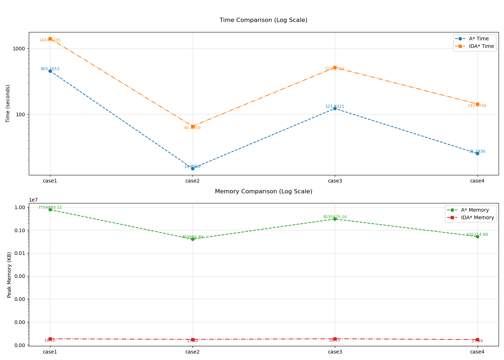

# 人工智能实验报告

**课程名称**：**Artificial Intelligence**

**专业（方向）**：信息与计算科学

**学号**：23323035

**姓名**：崔行健

**实验题目**：启发式搜索解决15-Puzzle问题

---

## 1. 实验内容

### 1.1 算法原理

#### A*算法

A* 算法是基于一致代价搜索算法的优化， $h(n)$ 是可采纳的 A 算法。算法利用节点对应的 $f(n)$ 值来对边界上的节点进行排序，并总扩展边界中具有最小 $f$ 值的节点。

#### IDA*算法

IDA* 算法是 **A\*算法与迭代加深搜索（IDS）的结合**，旨在解决A*算法的空间复杂度问题。其以深度优先搜索替代广度优先扩展，将空间复杂度从指数级降为线性。同时利用启发式函数值 $f(n) = g(n) + h(n)$ 替代深度作为搜索限制，逐步逼近最优解。

一开始设置深度限制为 $FL = f(根节点)$（若 $FL \lt f(根节点)$，算法无法开始，无意义），我们迭代的增加深度限制按  $f$ 值从小到大依次进行深度搜索。在每次迭代时，IDA* 划定的界限是 $ f $ 值超过上次迭代的界限最少的节点的 $ f $ 值，直到找到目标结果。

#### 环检测优化

这两个不需要进行环检测优化，或者说利用 $g$ 值的特性隐式环检测优化即可。因为当节点被加入 close 集合时，算法已确定到达该节点的最优路径（即最小 $g$ 值）。后续生成的同一节点的任何新路径，其 $g$ 值必然不小于已记录的最小 $g$ 值，因此对应的 $f$ 值 $(g+h)$ 不会更优，可安全忽略。


### 1.2 伪代码

#### A*伪代码
```text
Input: start_state, goal_state
Output: solution path
1. Initialize priority queue with start_state (f = h(start))
2. While queue not empty:
   a. Pop state with minimal f-value
   b. If state == goal: return path
   c. For each neighbor:
      i. Calculate g_new = g[current] + 1
      ii. If neighbor not in close:
          - Update g, h, f values
          - Add to priority queue
3. If exit while loop return No solution
```

#### IDA*伪代码
```text
Input: start_state, goal_state
Output: solution path
1. Set f_limit = f(start_state)
2. While True:
   a. Perform DFS with f <= f_limit
   b. Record minimum exceeded f-value
   c. If solution found: return path
   d. Else: f_limit = min_exceeded_f
```

### 1.3 关键代码展示

#### A*核心逻辑
```python
def A_star(start_state, goal_state):
    """A* search algorithm implementation for 15-puzzle solving."""
    frontier = PriorityQueue()
    came_from = {start_state: None}      # Key: child state, Value: (parent state, move)
    g = {start_state: 0}
    h = {start_state: heuristic(start_state)}
    f = {start_state: g[start_state] + h[start_state]}
    
    close = set()
    
    frontier.put((f[start_state], start_state))
       
    while not frontier.empty():
        if DEBUG:
            print(f"frontier.qsiez: {frontier.qsize()}")
            
        _, current = frontier.get()

        """
        1. 若当前的g值小于用于队列中排序的g值，说明这个节点已经过时
        2. 若当前节点已经在close集中，不需要重复处理
        """
        # 若当前节点已经在close集中，说明该节点g值更小的路径已经被拓展，不需要重复处理
        if current in close:
            continue
        
        close.add(current)
        
        if current == goal_state:
            return reconstruct_path(came_from, current)
        
        for neighbor, move in generate_children(current):
            """
            1. 不需要进行环检测。或者说，利用g值是否更优进行环检测
            2. 如果新路径不比旧路径好，就跳过
            """
            if neighbor not in g or g[current] + 1 < g[neighbor]:
                came_from[neighbor] = (current, move)
                g[neighbor] = g[current] + 1
                h[neighbor] = heuristic(neighbor)
                f[neighbor] = g[neighbor] + h[neighbor]
                frontier.put((f[neighbor], neighbor))
    
    return None # No solution found
```

#### IDA*核心逻辑
```python
FOUND = 0
def IDA_star(start_state, goal_state):
    def search(path, direction, g, f_limit):
        state = tuple(path[-1])
        current_f = g + manhattan_distance(state)
        if current_f > f_limit:
            return current_f
        if state == goal_state:
            return FOUND
        min_f = float('inf')
        
        new_path = [
            (g + 1 + manhattan_distance(neighbor), neighbor, move) 
            for neighbor, move in generate_children(state) 
            if neighbor not in path
        ]        
                
        new_path.sort()
                
        for _, neighbor, move in new_path:
                path.append(neighbor)
                direction.append(move)
                t = search(path, direction, g+1, f_limit)
                if t == FOUND:
                    return FOUND
                if t < min_f:
                    min_f = t
                path.pop()
                direction.pop()
        return min_f

    f_limit = manhattan_distance(start_state)
    path = [start_state]
    direction = [None]
    while True:
        t = search(path, direction, 0, f_limit)
        if t == FOUND:
            return zip(path, direction)
        if t == float('inf'):
            return None
        f_limit = t
```

### 1.4 启发式函数选择

#### 1.4.1 错位的数码数量

错位的数码数量（Hamming距离）是指当前状态与目标状态相比，位置不匹配的数码块数量。其计算简单，时间复杂度为 $O(n)$，同时满足可采纳性，即 $h(s) \le h^*(s)$，能保证 A* 算法找到最优解。但是其对距离的估计较粗糙，可能高估实际移动步数（例如需多次移动才能纠正一个错位），导致搜索效率较低，A* 算法需要扩展更多节点

#### 1.4.2 曼哈顿距离

曼哈顿距离是指每个数码块从当前位置移动到目标位置所需的水平和垂直步数之和。其更精确估计实际移动代价，但计算复杂度略高。

#### 1.4.3 曼哈顿距离+相邻位置颠倒法

所谓位置，两个相邻数码块的位置发生颠倒。如此一来，若想将两个数码块都移动到目标位置，就必须让一块”绕路“，至少产生 2 次的额外移动

### 1.5 优化 & 创新点

采用了**曼哈顿距离+相邻位置颠倒法**的优化，相较于简单的曼哈顿距离，考虑了更多的影响因素。同时也保证了可采纳性。

## 2. 实验结果及分析

### 2.1 测试案例展示

为方便展示，将矩阵按行优先在此展示。可视化结果请看result文件夹

#### 2.1.1. 简单测试

简单测试主要用于验证算法的正确性，规模较小

case1：`(2, 3, 4, 8, 1, 6, 7, 0, 5, 10, 15, 11, 13, 14, 9, 12)`

case2：`(0, 1, 4, 8, 6, 3, 7, 12, 5, 2, 9, 11, 13, 10, 14, 15)`

#### 2.1.2. 性能测试

性能测试从小规模（case1, case2）、中规模（case3, case4）、大规模（case5, case6），测试算法的时空消耗

case1：`(1, 2, 4, 8, 5, 7, 11, 10, 13, 15, 0, 3, 14, 6, 9, 12)`

case2：` (5, 1, 3, 4, 2, 7, 8, 12, 9, 6, 11, 15, 0, 13, 10, 14)`

case3：`   (14, 10, 6, 0, 4, 9, 1, 8, 2, 3, 5, 11, 12, 13, 7, 15)`

case4：` (6, 10, 3, 15, 14, 8, 7, 11, 5, 1, 0, 2, 13, 12, 9, 4)`

case5：`(11, 3, 1, 7, 4, 6, 8, 2, 15, 9, 10, 13, 14, 12, 0, 5)`

case6：`    (0, 5, 15, 14, 7, 9, 6, 13, 1, 2, 12, 10, 8, 11, 4, 3)`

#### 2.1.3. 随机测试

随机测试利用 15-puzzle 问题的随机生成函数生成测试案例，然后求解问题

### 2.2 实验结果与性能对比

#### 2.2.1 正确性验证

正确性测试解题过程

<table rules="none" align="center">
	<tr>
		<td>
			<center>
                
				<br/>
				<font color="AAAAAA">case1.jpg</font>
			</center>
		</td>
		<td>
			<center>
                
				<br/>
				<font color="AAAAAA">case 2.jpg</font>
			</center>
		</td>
	</tr>
</table>

A* 和 IDA* 的输出结果

<table rules="none" align="center">
	<tr>
		<td>
			<center>
                
				<br/>
				<font color="AAAAAA">A* case1</font>
			</center>
		</td>
		<td>
			<center>
                
				<br/>
				<font color="AAAAAA">A* case 2</font>
			</center>
		</td>
		<td>
			<center>
                
				<br/>
				<font color="AAAAAA">IDA* case1</font>
			</center>
		</td>
		<td>
			<center>
                
				<br/>
				<font color="AAAAAA">IDA* case2</font>
			</center>
		</td>
	</tr>
</table>


通过比对 A* 、IDA* 以及正确的解题过程，可以认为，算法具有正确性

#### 2.2.2 启发式函数比较

错位的数码数量和曼哈顿距离都能通过正确性测试，但是前者无法通过性能测试的第三个测例以上。而曼哈顿距离表示的较好，成功通过性能测试的所有测例。

曼哈顿距离启发式函数具有以下特性：

1. **可接纳性**：始终 $\le$ 实际步数，保证最优解
2. **一致性**：满足三角不等式 $$ h(n) \leq cost(n,n') + h(n') $$
3. **计算效率**：$O(n)$ 时间复杂度，适合高频调用

在网格环境中（例如棋盘、拼图、机器人平面移动），物体的移动通常被限制为水平或垂直方向（即上下左右），不允许对角线移动。曼哈顿距离恰好模拟了这种移动规则。与Hamming距离对比，Hamming距离仅统计错位数量，而忽略移动的实际距离。但曼哈顿距离的启发式信息更丰富，能显著减少A* 算法扩展的节点数量。与欧几里得距离对比，曼哈顿距离严格匹配网格移动规则，避免低估问题。

#### 2.2.3 曼哈顿距离性能测试

性能测试解题过程：

<table rules="none" align="center">
	<tr>
		<td>
			<center>
                
				<br/>
				<font color="AAAAAA">case1</font>
			</center>
		</td>
		<td>
			<center>
                
				<br/>
				<font color="AAAAAA">case 2</font>
			</center>
		</td>
		<td>
			<center>
                
				<br/>
				<font color="AAAAAA">case3.jpg</font>
			</center>
		</td>
	</tr>
</table>

<table rules="none" align="center">
	<tr>
		<td>
			<center>
                
				<br/>
				<font color="AAAAAA">case4</font>
			</center>
		</td>
		<td>
			<center>
                
				<br/>
				<font color="AAAAAA">case 5</font>
			</center>
		</td>
		<td>
			<center>
                
				<br/>
				<font color="AAAAAA">case6</font>
			</center>
		</td>
	</tr>
</table>


性能测试结果：

##### 1. 时间效率的对比

* **A*算法在小规模问题中表现更优：**

  在简单场景（case1, case2）中，A* 与 IDA* 的时间消耗相近（均低于0.002秒），但 A* 在中、大规模问题（case3 -- case5）中显著优于IDA* 。例如，在 case5 中，A* 耗时791.97秒，而 IDA* 耗时 6924.20 秒，差距近 10 倍。在 case6 中，IDA* 甚至无法在 18 小时内计算出结果
  
  **原因**：A* 利用 close 列表高效管理状态，而 IDA* 因深度优先的迭代回溯特性，在复杂分支中重复搜索路径，导致时间成本增加。  
  
* **IDA*在大规模问题中存在局限性：**

  在case6中，A* 仍能完成搜索（耗时 3397.94 秒），而 IDA* 未返回结果（数据缺失），表明其可能因递归深度或超时阈值限制无法解决极端复杂问题。

##### 2. 内存消耗的对比

* **IDA* 内存占用显著低于A* ：**

  IDA* 在所有案例中的峰值内存始终低于 30 KB，而 A* 在 case3 后内存需求急剧上升（case6 高达 26.28G）

  **原因**：A* 需维护庞大的开放列表存储所有待扩展节点，而 IDA* 基于深度优先搜索，仅需存储当前路径的节点，空间复杂度为 $O(bd)$（分支因子×深度），远低于 A* 的 $O(b^d)$。  

* **A*内存瓶颈明显：**

  在复杂问题（如 case3 - case6）中，A* 的内存占用呈指数级增长（从 12.4G 到 26.28G），可能因硬件资源限制无法处理超大规模场景。  

##### 3. 算法适用场景总结  
| **算法** | **优势场景**                                   | **劣势场景**                   |
| -------- | ---------------------------------------------- | ------------------------------ |
| **A***   | 中小规模问题、内存充足环境、需快速求解最优路径 | 超大规模问题、内存受限环境     |
| **IDA*** | 内存敏感场景、允许较高时间成本、路径深度可控   | 分支因子过大、超深递归路径问题 |

##### 4. 实验局限性

*  **数据覆盖范围有限：**实验只是使用了有限的测例来验证算法的正确性和性能
* **硬件环境影响：**实验在本地主机进行，而本地主机资源有限、性能波动大，让实验结果增加了偶然性

#### 2.2.4 曼哈顿距离随机测试

random case1：`(1, 8, 0, 15, 11, 14, 6, 13, 10, 5, 9, 12, 4, 7, 2, 3)`   

random case2：`(11, 5, 2, 14, 13, 12, 9, 3, 10, 0, 6, 1, 8, 4, 15, 7)`

random case3：`(10, 0, 15, 3, 8, 11, 6, 13, 14, 1, 12, 9, 7, 5, 2, 4)`

random case4：`(0, 6, 5, 10, 3, 4, 1, 14, 8, 11, 12, 15, 13, 7, 2, 9)`



可见，随机测试仍然符合性能测试的规律。

#### 2.2.5 曼哈顿距离+位置颠倒法

仍然采用性能测试的测例，对 A* 算法进行测试。


可以发现，随着数据规模的增大，曼哈顿距离+位置颠倒法的耗时降低。尤其在 case6，从 3397s 降低到 1864s。验证了这个启发式函数的优越表现

## 3. 思考题

### 3.1 优先队列性质
Python的`PriorityQueue`实现基于堆结构，保证：
1. 插入/删除时间复杂度为 $O(log n)$
2. 队首元素始终为最小 $f$ 值
3. 线程安全但存在 GIL 锁影响

在启发式函数中，优先权队列用来辅助取出整个边界空间中 $f$ 值最小的状态

### 3.2 IDA*优化方向
1. **双向搜索**：同时从初始状态和目标状态展开
2. **模式数据库**：预计算子问题的最优解
3. **并行化**：多线程处理不同阈值迭代

## 4. 代码架构

```
Lab3/
├── result/
├── A_star.py
├── IDA_star.py
└── main.py
```

## 5. 参考文献

1. Python官方文档：PriorityQueue实现原理
2. 《15-谜问题的可达性判定》宋文等，电子科技大学学报2004
3. [A* 与 IDA* 算法在15-puzzle问题中的优化与比较-CSDN博客](https://blog.csdn.net/m0_52387305/article/details/123531945)
4. [【人工智能】A* 算法和 IDA* 算法求解15-puzzle问题（大量优化，能优化的基本都优化了）_十五数码问题 a* -CSDN博客](https://blog.csdn.net/wuyzh39/article/details/130072858)

****

**附录**：完整代码见提交的code文件夹，包含详细注释和测试用例说明。