# 人工智能实验报告

**课程名称**：**Artificial Intelligence**

**专业（方向）**：信息与计算科学

**学号**：23323035

**姓名**：崔行健

**实验题目**：多层感知机（MLP）

****

## 1. 实验内容

### 1.1 算法原理

#### 1.1.1 人工神经网络

多层感知机包含三个层次：一个输入层，一个或多个中间层 (也叫隐藏层，hidden layer) 和一个输出层。输入层与输出层的节点数是固定的，中间层则可以自由指定。


可以看见，神经元之间是全连接的。对每个神经元，上一层的数据通过加权线性求和后，经过当前神经元的激活函数，得到当前神经元的输出。每一层的计算依次向前，即可得到输出。如下图所示：


#### 1.1.2 激活函数

激活函数有很多种类，对于不同激活函数的作用，我们在后续的实验结果分析再做解释。如下是常见的几种激活函数：

1. **sigmoid**

   数学表达式为：
   $$
   sigmoid(x) = \frac{1}{1 + e^{-x}}
   $$
   求导表达式为：
   $$
   \frac{d(sigmoid(x))}{dx} = sigmoid(x)(1 - sigmoid(x))
   $$
   函数图像为

   

2. **Tanh**

   数学表达式为：
   $$
   Tanh(x) = \frac{e^x - e^{-x}}{e^x + e^{-x}}
   $$
   函数图像如下：

   

3. **ReLU**

   数学表达式为：
   $$
   ReLU(x) = max(0, x)
   $$
   函数图像如下：

   

4. **Softmax**

   数学表达式为：
   $$
   Softmax(x) = \frac{e^{x_i}}{\sum_i e^{x_i}}
   $$
   函数图像如下：

   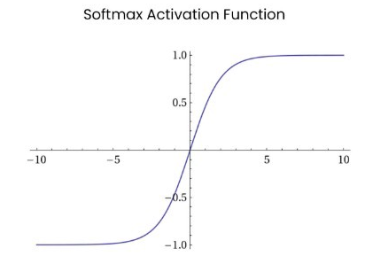

#### 1.1.3 损失函数

为了衡量模型是否表现良好，并为之后的网络参数优化提供指导。常用的损失函数如下：

1. **均方误差（MSE）**
   $$
   MSE = \frac{1}{n} \sum_{i=1}^{n}(y_i - \hat y_i)
   $$

2. **交叉熵（LCE）**
   $$
   LCE = -\sum_i^n \sum_j^k y_j^{(i)} \log {\hat y_j^{(i)}} 
   $$

   * $y_j^{(i)}$ 是第 $j$ 个输入参数在第 $i$ 个输出的真实值。
   * $\hat y_j^{(i)}$ 是第 $j$ 个输入参数在第 $i$ 个输出的预测值。

在我们的实验中，我们选择以交叉熵作为损失函数来构建模型。

#### 1.1.4 梯度下降

给定多元可微函数 $f(\vec {w})$ 和其函数曲线上的一点 $P$，函数 $f$ 在点 $P$ 上的梯度就是函数 $f$ 在点 $P$ 上的偏导数。

**前向传播：**按顺序（从输入层到输出层）计算和存储神经网络中每层的结果。

**梯度下降算法：**每次计算参数在当前的梯度，然后让参数向着梯度的反方向前进一段距离，不断重复，直到梯度接近零时截止。一般这个时候，所有的参数恰好达到使损失函数达到一个最低值的状态。

**反向传播算法：**反向传播算法不一次计算所有参数的梯度，而是从后往前。首先计算输出层的梯度，然后是第二个参数矩阵的梯度，接着是中间层的梯度，再然后是第一个参数矩阵的梯度，最后是输入层的梯度。计算结束以后，所要的两个参数矩阵的梯度就都有了。

不断的重复**前向传播——反向创博**的过程，便可对我们的人工神经网络进行良好的训练了。

### 1.2 数据集划分

数据集分为训练集和测试集。二者已经通过文件命名给划分完成。训练集又将 20% 划分为验证集。

验证集不参与训练，仅用于监控模型是否过拟合（如早停机制）、调整超参数（学习率、隐藏层维度等）、选择最佳模型（基于验证集指标保存最优参数）。**测试集完全独立**，仅在最终评估中使用一次，确保性能指标无偏。

### 1.3 伪代码

```python
算法：多层感知机（MLP）训练流程

输入：
   数据集路径 data_path
   超参数：input_dim, hidden_dim, out_dim, num_layers, activation, dropout
   训练参数：batch_size, lr, epoch, patience

输出：
   训练完成的模型参数
   训练/验证损失曲线
   测试集评估指标

流程：

1. 数据准备
   1.1 加载MNIST数据集，分割为：
       - 训练集（80%）
       - 验证集（20%）
       - 测试集（固定独立集）
   1.2 创建DataLoader：
       - 训练集：shuffle=True
       - 验证/测试集：shuffle=False

2. 模型初始化
   2.1 构建MLP网络：
       - 输入层 → [隐藏层×N] → 输出层
       - 每层包含：Linear → Activation → Dropout
       - 输出层无激活函数
   2.2 定义：
       - 损失函数：交叉熵损失（CrossEntropyLoss）
       - 优化器：SGD/Adam/AdamW
       - 评估指标：准确率、F1分数、召回率、精确率

3. 训练循环（epoch迭代）
   for epoch = 1 to max_epoch do
       3.1 训练阶段（train模式）
           for 每个batch in 训练集 do
               a. 数据迁移到指定设备（CPU/GPU）
               b. 梯度清零（optimizer.zero_grad()）
               c. 前向传播计算输出
               d. 计算损失值
               e. 反向传播（loss.backward()）
               f. 参数更新（optimizer.step()）
               g. 记录预测标签和真实标签
           end for
           计算训练集指标：acc, f1, loss

       3.2 验证阶段（eval模式）
           for 每个batch in 验证集 do
               a. 数据迁移到设备
               b. 前向传播（无梯度计算）
               c. 计算损失和预测结果
           end for
           计算验证集指标：acc, f1, loss

       3.3 早停判断
           if 当前验证F1 > 历史最佳F1 then
               保存模型参数
               重置早停计数器
           else
               早停计数器 +1
           end if

           if 早停计数器 ≥ patience then
               终止训练
           end if
   end for

4. 测试评估
   4.1 加载最佳模型参数
   4.2 在测试集上执行前向传播
   4.3 计算最终指标：
       - 分类报告（per-class指标）
       - 总体准确率/F1分数
   4.4 生成损失曲线图

5. 输出结果
   保存：
   - 模型参数文件（.pt）
   - 训练/验证损失曲线图（.png）
   - 日志文件（含完整评估指标）
```

### 1.4 关键代码展示

1. MPL 类实现

   ```python
   class MLP(nn.Module):
       def __init__(self, input_dim, hidden_dim, out_dim, device, num_layers, activation, dropout):
           super().__init__()
           if num_layers < 2:
               raise ValueError("num_layers must be at least 2")
           
           # 参数初始化
           self.device = device
           self.input_dim = input_dim
           self.hidden_dim = hidden_dim
           self.out_dim = out_dim
           self.num_layers = num_layers
           self.dropout = dropout
           
           # 激活函数映射表
           activation_map = {
               'relu': nn.ReLU(),
               'sigmoid': nn.Sigmoid(),
               'tanh': nn.Tanh(),
               'softmax': nn.Softmax(dim=1),
               'none': nn.Identity()
           }
           if activation not in activation_map:
               raise ValueError(f"Unsupported activation: {activation}")
           self.activation = activation_map[activation]
   
           # 动态构建网络层
           layers = []
           current_dim = input_dim
           
           for _ in range(num_layers - 1):
               layers += [
                   nn.Linear(current_dim, hidden_dim),
                   self.activation,
                   nn.Dropout(dropout) if dropout > 0 else nn.Identity()
               ]
               current_dim = hidden_dim  # 后续层输入维度统一
           
           # 添加输出层（无激活函数）
           layers.append(nn.Linear(hidden_dim, out_dim))
           
           # 组合成顺序模型
           self.net = nn.Sequential(*layers).to(device)
   
       def forward(self, x):
           # 直接调用网络序列
           return self.net(x)
   ```

2. 数据加载——以训练集为例

   ```python
   train_loader = DataLoader(
   	train_set, 			# 选择训练集
       batch_size=args.batch_size, 		# 选择批大小，批越大，内存要求越过，训练速度越快（在满内存之前）
       shuffle=True,		# 打乱数据顺序，这非常重要
       collate_fn=Mnist1DDataset.collate_fn
   )
   ```

3. 声明模型、损失函数、优化器

   ```python
   device = torch.device(args.device)
   
   model = MLP(
   	input_dim=args.input_dim,
       hidden_dim=args.hidden_dim,
       out_dim=args.out_dim,
       device=device,
       num_layers=args.num_layer,
       activation=args.activation,
       dropout=args.dropout
   )
   model = model.set_device(device)
   
   
   # claim the loss function
   criterion = torch.nn.CrossEntropyLoss()     # 交叉熵损失衡量
   
   # claim the optimizer
   if args.optimizer.lower() == 'sgd':
   	optimizer = optim.SGD(model.parameters(), lr=args.lr)
   elif args.optimizer.lower() == 'adam':
   	optimizer = optim.Adam(model.parameters(), lr=args.lr)
   elif args.optimizer.lower() == 'adamw':
   	optimizer = optim.AdamW(model.parameters(), lr=args.lr)
   else:
   	raise ValueError(f"Unsupported optimizer: {args.optimizer}")
   ```

4. 在训练集上训练模型

   ```python
   model.train() # 设置为训练模式，使得dropout生效
   for pack_images, y in train_loader:
   	# put the data above to device
       pack_images = pack_images.to(device)
       y = y.to(device)
               
       # 记录真实标签
       truth = truth + y.tolist()
   
       # forward and backward
       optimizer.zero_grad()          # 清零梯度
       output = model(pack_images)     # 前向计算 [batch_size, out_dim]
       loss = criterion(output, y)    # 计算损失
       loss.backward()                # 反向传播
       optimizer.step()               # 更新参数
   
       # 记录预测结果和损失
       predict += output.argmax(dim=1).tolist()  # 取概率最大的类别作为预测结果
       total_loss += loss.item()      # 累加损失值
   ```

5. 在验证集上测试并保存最好的模型，并判断早停

   ```python
   model.eval() # 设置为测试模式，使得dropout不生效
   for pack_images, y in val_loader:
   	with torch.no_grad():  # 禁用梯度计算
       	pack_images = pack_images.to(device)
           y = y.to(device)
   
           truth = truth + y.tolist()
   
           output = model(pack_images)      # 前向计算
           loss = criterion(output, y)     # 计算损失
           # 记录结果
           predict += output.argmax(dim=1).tolist()
           total_loss += loss.item()
   
   # save the best model or ignore this code
   if marco_f1 > best_val_f1:
   	best_val_f1 = marco_f1
       # 保存模型参数
       torch.save(model.state_dict(), args.save_path)
       logging.info(f"发现新最佳模型，验证F1分数: {best_val_f1:.4f}")
       early_stop_count = 0  # 重置早停计数器
   else:
   	early_stop_count += 1
       logging.warning(f"早停计数器: {early_stop_count}/{args.patience}")
   
   
   # 早停：验证集上连续多次性能测试没有提升，则停止训练
   if early_stop_count >= args.patience:
   	logging.warning(f"早停触发！连续 {args.patience} 轮验证F1未提升")
       break  # 终止训练循环
   ```

6. 在测试集上测试

   ```python
   model.eval()
   for pack_images, y in tqdm(test_loader, desc="[test on test set] ", leave=False):
   	with torch.no_grad():
       	pack_images = pack_images.to(device)
           y = y.to(device)
               
           truth = truth + y.tolist()
   
           output = model(pack_images)         # 前向计算
           loss = criterion(output, y)        # 计算损失
               
           # 记录结果
           predict += output.argmax(dim=1).tolist()
           total_loss += loss.item()
   ```

## 2. 实验结果及分析

### 2.1 评测指标

1. **类别级指标**

   - **precision（精确率）**：预测为某类的样本中实际属于该类的比例。

     计算公式：
     $$
     Precision = \frac{TP}{TP + FP} \\
     $$
     
     * **TP (True Positive)**：正确预测为正类的样本数（预测为A类，实际也是A类）
     * **FP (False Positive)**：错误预测为正类的样本数（预测为A类，实际是其他类）
     * $TP + FP$：预测为正类的总预测数
     
   - **recall（召回率）**：实际属于某类的样本中被正确预测的比例。
   
     计算公式：
     $$
     Recall = \frac{TP}{TP + FN}
     $$
   
     * **TP (True Positive)**：正确预测为正类的样本数（预测为A类，实际也是A类）
     * **FN (False Negative)**：错误预测为负类的样本数（实际是A类，但被预测为其他类）
   
   - **f1-score**：精确率和召回率的调和平均，综合反映分类质量。
   
     计算公式：
     $$
     F1 = 2 \times \frac{Precision \times Recall}{Precision + Recall}
     $$
   
2. **全局指标**

   - **accuracy**：整体正确分类比例

     计算公式：
     $$
     Accuracy = \frac{正确预测的样本数}{总样本数}
     $$

   - **macro avg**：各类别指标的算术平均

   - **weighted avg**：按样本量加权的平均指标

   由于各类指标同等重要，因此我们选择 accuracy 来作为性能的评价指标。

### 2.2 实验结果展示及分析

为了更全面的展示不同超参数对模型的影响，笔者选择了多种参数的排列组合方式，逐一比较不同参数的性能。

#### 2.2.1 隐藏层维度、隐藏层层数、迭代次数对模型性能的影响

其他参数：

* activation：ReLU
* batch-size：512
* dropout：0.1
* optimizer：sgd
* learn-rate：0.01
* patience：20

实验结果：

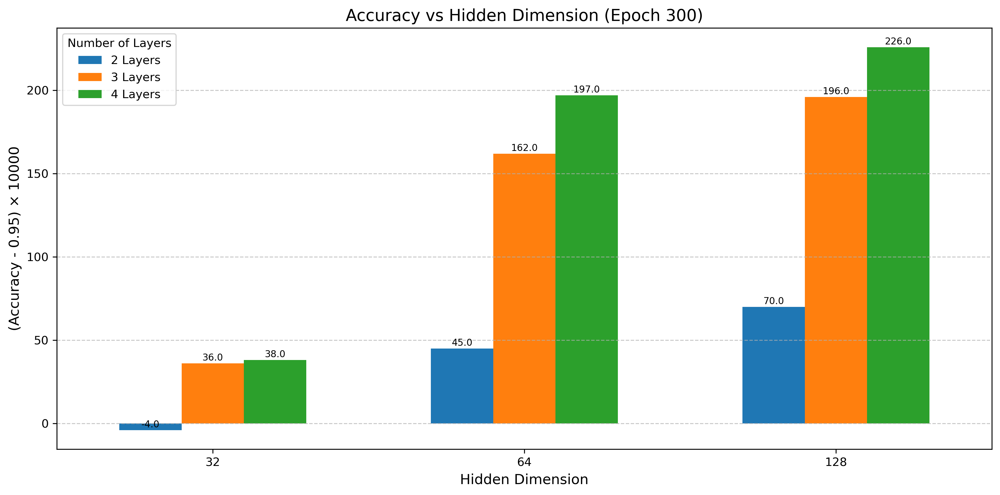


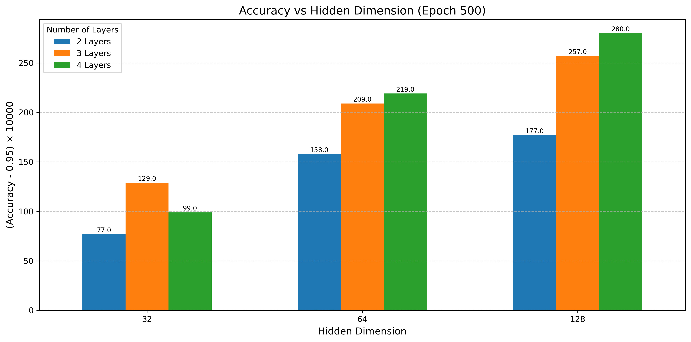

从实验结果来看，隐藏层维度越高，隐藏层层数越多，训练迭代次数越多，得到的模型性能越佳。但从理论上来看，这有点违背所认识的理论。

首先，对隐藏层维度，笔者向对 AI 方面研究较深的同学询问过，越高维所能表达的特征越多。然而，在这个案例中，输入层的维度就已经到达 128 了。所以笔者猜想，如果隐藏层维度小于 128，模型信息会有些许损失，影响到预测精度。

再者，在隐藏层层数来看，层数越多，梯度消失效应本该越强。但在实验过程中的四层的隐藏层层数仍然不算特别多，因此表现出层数越多模型性能越好的结果。同理，迭代次数受 CPU训练速度的限制没有很多，故表现出迭代次数越多，模型性能越好的结果。

这组实验测得的准确率都在 0.94 ~ 0.98 之间。超参数的变化实际上对性能的影响不高，实验数据不够有太强的说服力。

#### 2.2.2 优化器

其他参数：

* hidden-dim：128
* num-layer：4
* activation：ReLU
* batch-size：512
* dropout：0.1
* learn-rate：0.01
* epoch：400
* patience：20

实验结果：

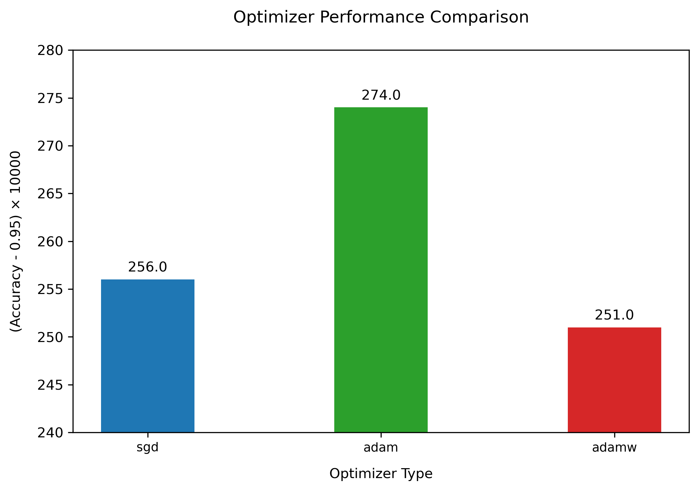

实验结果用上，准确率都在 0.95 左右，不同优化器对实验结果的影响较小，实验说服力较弱。

#### 2.2.3 学习率

其他参数：

* hidden-dim：128
* num-layer：4
* activation：ReLU
* batch-size：512
* dropout：0.1
* optimizer：sgd
* epoch：400
* patience：20

实验结果：

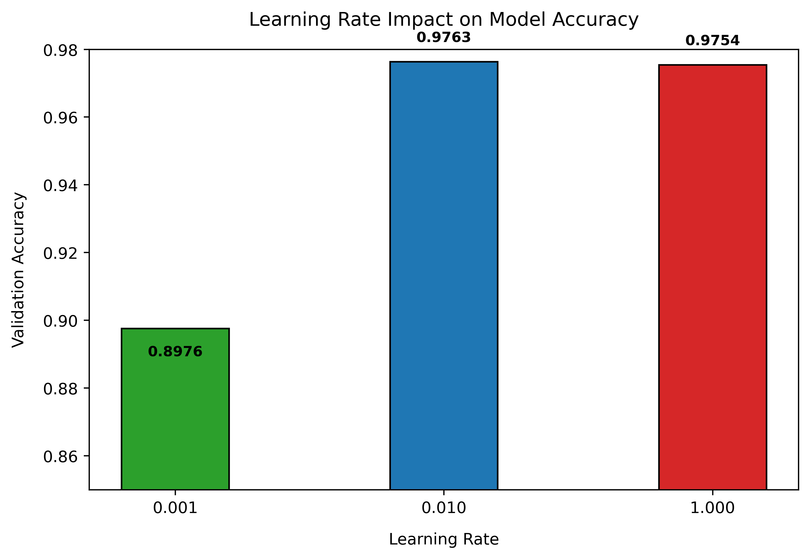

从该实验结果上看，实验出现了明显的变化。0.001 的学习率训练的效果远远低于其他学习率。为了更深入的分析，我们来比较一下训练过程 loss 值的变化。

<table rules="none" align="center">
	<tr>
		<td>
			<center>
                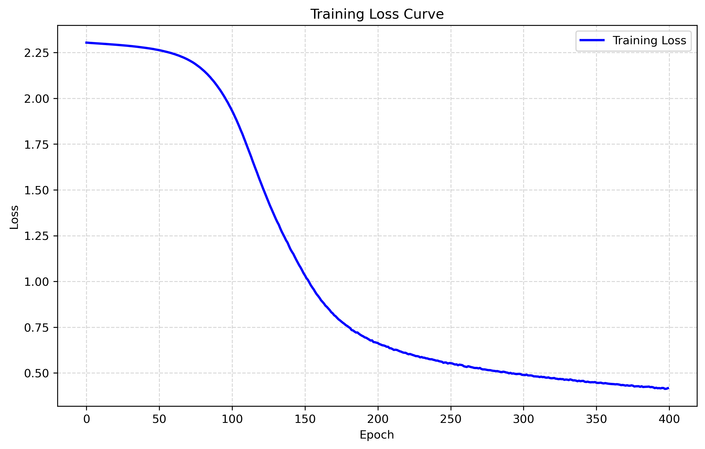
				<br/>
				<font color="AAAAAA">learn rate = 0.001</font>
			</center>
		</td>
		<td>
			<center>
                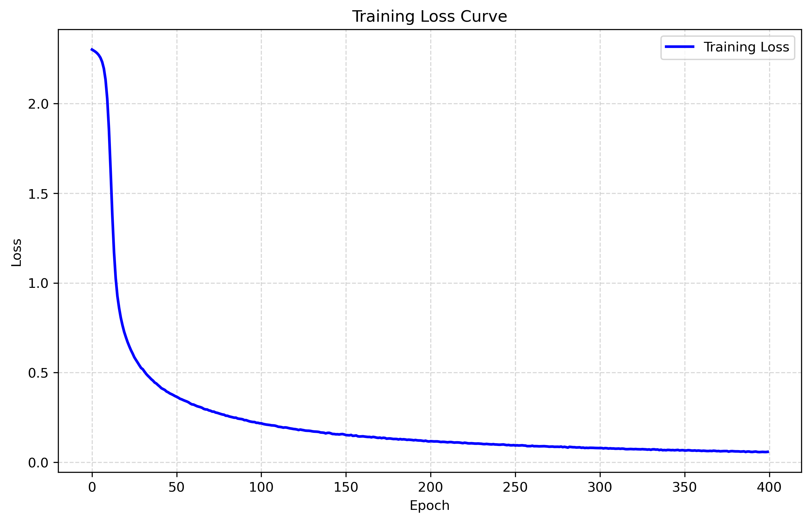
				<br/>
				<font color="AAAAAA">learn rate = 0.01</font>
			</center>
		</td>
		<td>
			<center>
                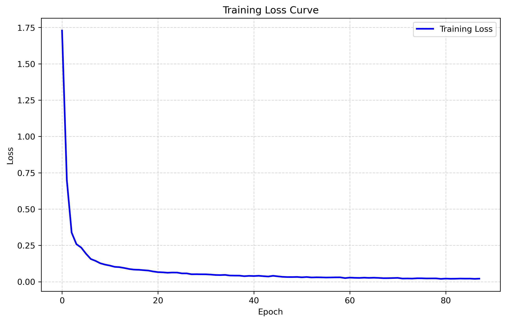
				<br/>
				<font color="AAAAAA">learn rate = 1</font>
			</center>
		</td>
	</tr>
</table>

由此图不难发现为什么实验结果会发生这种变化。当学习律过低的时候，学习速度过慢，loss 值下降的过慢。因此，在迭代次数有限的情况下，模型的性能会显著偏低。

#### 2.2.4 激活函数

其他参数：

* hidden-dim：128
* num-layer：4
* batch-size：512
* dropout：0.1
* optimizer：sgd
* learn rate：0.01
* epoch：400
* patience：20

实验结果：


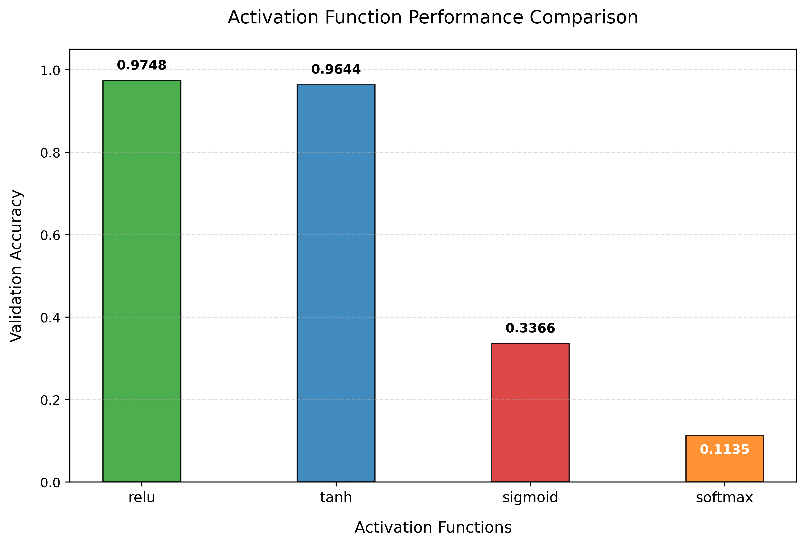

可以发现，sigmoid 和 softmax 激活函数的性能显著偏低。

我们还是看看二者 loss 的变化过程：

<table rules="none" align="center">
	<tr>
		<td>
			<center>
                
				<br/>
				<font color="AAAAAA">sigmoid</font>
			</center>
		</td>
		<td>
			<center>
                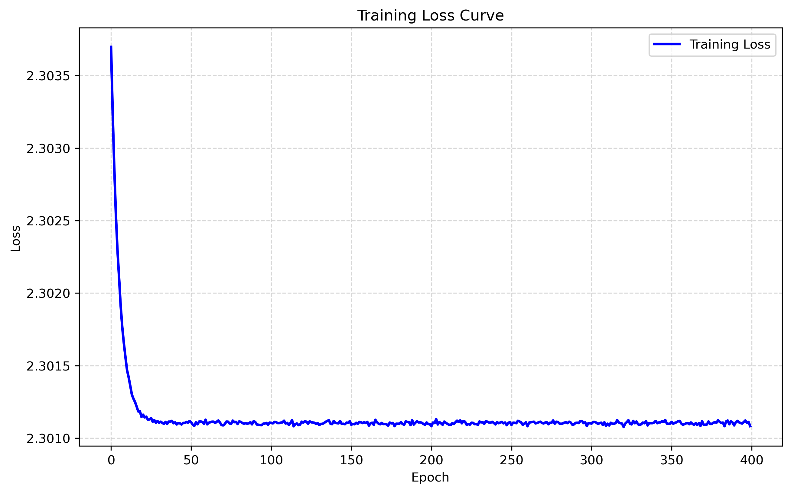
				<br/>
				<font color="AAAAAA">softmax</font>
			</center>
		</td>
	</tr>
</table>

发现，对于 sigmoid，只有当迭代到达一定次数后，loss 才会开始显著下降，这与前面的 loss 非常的不同。说明当迭代次数增加后，其或许还有救。当对 softmax 激活函数，其早早的就稳定在了一个较高的 loss 值，说明 softmax 函数并不使用于 MPL 的激活函数。

我们来增加迭代次数到 800 看看 sigmoid 的性能变化。

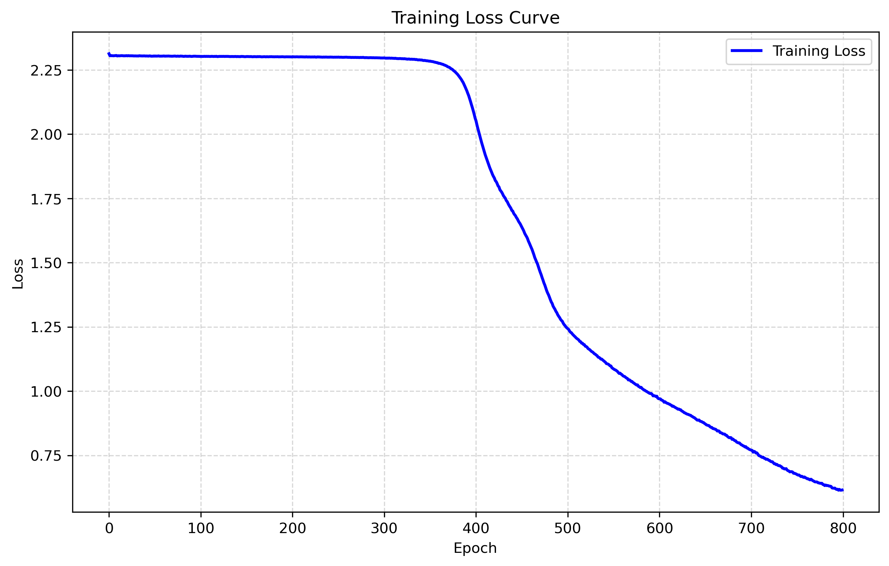

其 loss 值得到明显下降。相应的，其 accuracy 值也提升到了 0.8491。这验证了我们的猜想。然而，考虑到迭代次数的影响，我们还是认为 sigmoid 的效果不如 ReLU 和 tanh 激活函数。

## 3. 总结

本实验验证了不同超参数对 MPL 模型性能的影响规律：

1. **网络结构方面：**隐藏层维度（32→ 64→ 128）和层数（2 → 4）的增加可提升模型性能（测试准确率94.7%→98.2%）
2. **优化策略方面：**学习率对收敛速度影响显著：0.001时收敛缓慢（400 epoch未饱和），0.01时稳定收敛
3. **激活函数对比：**sigmoid 函数需要更多的迭代，softmax 函数不适用于 MPL··

本实验验证了MLP在图像分类任务中的有效性，为理解神经网络工作原理提供了实践依据。未来可进一步探索模型压缩（量化、剪枝）等技术，提升实际部署效率。