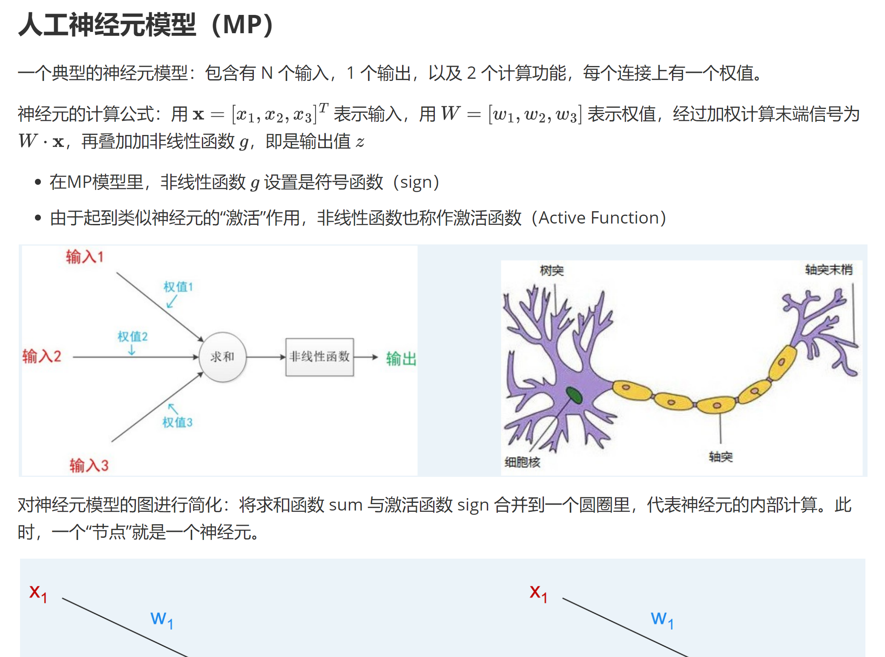

# MLP 实验经验分享

## 个人自我介绍

* 姓名：崔行健
* 专业：信息与计算科学
* Github 仓库：https://github.com/Triglang/Artificial-Intelligence

## 理论知识预备

我们的 AILab 和理论课是配套进行的。对我个人而言，我更愿意把实验当作理论知识的一个补充，更希望实验课是为了我自己的理论课所服务。因此，做实验前可以先仔细先看一遍理论的课件、做一些[笔记](./Note)。

* 在笔记里，虽然大多数都是记录一些课件里面已有的知识，但也偶尔可以对一些重点难点的内容做上自己的一些标注，以及根据知识的内容重构知识结构。这样有利于加深对知识的理解。

有些时候，前面**用到**的知识的原理会放在**后面**才讲，这个时候我们可以把**后面**的知识的笔记做到**前面**。这样复习一遍下来，对理论知识的印象就能更加深刻。

## 实验代码编写

作为 AI 领域的初学者，其实 AILab 的很多代码写法我都从来没写过，pytorch 我也从来没用过，调库我也不知道有什么库可调。对此，我觉得可以抱着学习的心态去写代码，而不是纯粹的想着我有从零开始手搓一段代码。所以，在每次开始写代码之前，我们都可以借助一些工具去学习一些代码：

1. [CSDN](https://blog.csdn.net/m0_73798143/article/details/136636647)
2. [Github](https://github.com/91Mrcui/SYSU_AI_lab)
3. AI

对于 AI 工具，经常用它做实验的的同学（bushi）应该有过一种体会，就是如果将整段的代码直接 copy 

## 实验报告

建议软件：typora

建议语言：markdown

借助 AI 工具

