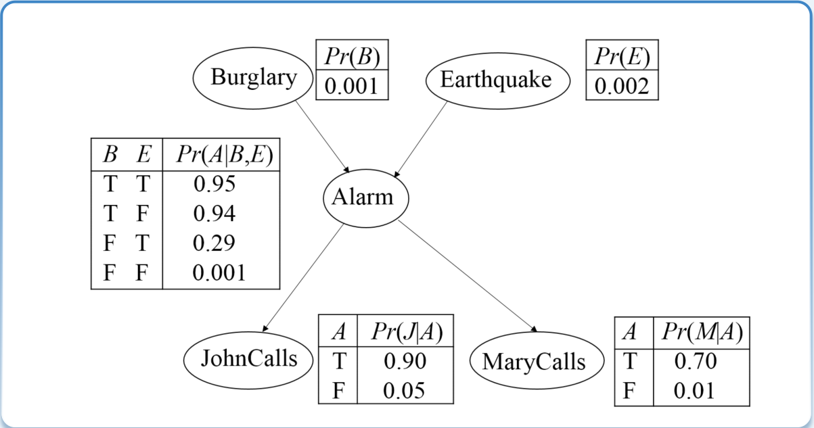
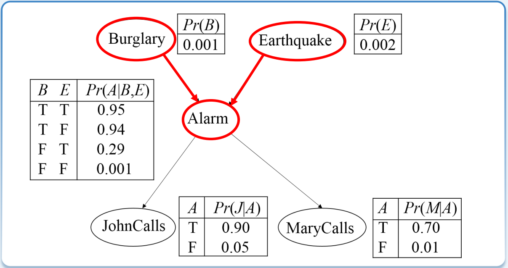
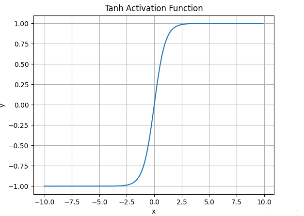

# Artificial Intelligence

## 绪论

1. 三大学派：

   符号主义学派：从公理出发，由逻辑推理得到引理

   连接主义学派：认为人工智能源于仿生学，主要理论基础是神经网络，代表作是 MLP

   行为主义学派：来源于 “感知--动作” 型系统（强化学习）

## 知识表示和推理

### 前置知识

1. 项：常量、变量和函数

2. ==**置换**==：置换是形如 $\{x_1/t_1, x_2/t_2, \ldots, x_n/t_n\}$ 的有限集合，其中：

   - $\{x_1, x_2, \ldots, x_n\}$ 是互不相同的变量

   - $\{t_1, t_2, \ldots, t_n\}$ 是项（常量、变量或函数）

   - $x_i/t_i$ 表示用 $t_i$ 置换 $x_i$，其==**合法的前提**==是：

     1. 不允许 $t_i$ 和 $x_i$ 相同

        如：$\{ x/x \}$

     2. 不允许 $x_i$ 出现在 $t_i$ 中

        如：$\{x/f(x) \}$

     3. ==也不允许出现循环置换==

        如：$\{x/y, y/x\} \text{和} \{x/f(y), y/{f(x)}\}$

   注意：置换中的每个变量替换是**同时进行**的

   > 对于 $P(x, g(y, z))$，做置换 $\{x/y, y/f(a)\}$，
   >
   > 即 $P(x, g(y, z)) \{x/y, y/f(a)\} \Rightarrow P(y, g(f(a), z))$

3. 文字：原子公式及其否定

   - $ P $：正文字；$ \neg P $：负文字

   子句：任何文字的析取。某个文字本身也都是子句。

   - $ P \vee \neg Q $ 记作 $ (P, \neg Q) $
   - 空子句：不包含任何文字的子句，记作 NIL
     - 空子句是永假的，不可满足的。

   子句集：由子句构成的集合（子句的合取）

   - $ (P \vee \neg Q) \wedge (P \vee R) $ 记作 $ \{(P, \neg Q), (P, R)\} $

****

特殊符号

1. `⊢*Am`  或者 ``⊢Am`` ：

   公式序列 A1, A2, ..., Am 称作Am的一个证明，如果 Ai (1 ≤ i ≤ m)：

   - 或者是公理；
   - 或者由Aj1, ..., Ajk (j1, ..., jk < i)用推理规则推得。

   当这样的证明存在时，称Am为系统的定理，记作 `|-*Am`（*是形式系统的名称），或者简记为 |-Am

2. `Γ⊢*Am` 或者 `Γ⊢Am`：

   设 Γ 为一公式集合。公式序列 A1, A2, ..., Am 称作 Am 的以 Γ 为前提的演绎，如果 Ai (1 ≤ i ≤ m)：

   - 或者是 Γ 中的公式
   - 或者是公理
   - 或者由 Aj1, ..., Ajk (j1, ..., jk < i) 用推理规则推得。

   当有这样的演绎时，Am 称作 Γ 的演绎结果，记作 `Γ⊢*Am`（*是形式系统的名称），或者简记为 `Γ⊢Am`，称 Γ 和 Γ 的成员为 Am 的前提

3. $\models_i$ 或者 $ \models $：

   如果推理算法 $ i $ 可以根据 $ KB $ 导出结论 $ \alpha $，则形式化地记为：$ KB \models_i \alpha $

   将 $ S $ 逻辑上蕴含 $ C $ 记为 $ S \models C $

4. $\vdash$：

   记某个永真的子句集合为 $ S $，需要推理得到的子句为 $ C $，基于归结的推理过程从 $ S $ 推导出 $ C $ 记为 $ S \vdash C $

### 归结推理

1. 归结式：对于任意两个子句 $C_1$ 和 $C_2$，若 $C_1$ 中有一个文字 $L$，而 $C_2$ 中有一个与 $L$ 成互补的文字 $\neg L$，则分别从 $C_1$ 和 $C_2$ 中删去 $L$ 和 $\neg L$，并将其剩余部分组成新的析取式。这个新的子句被称为 $C_1$ 和 $C_2$ 关于 $L$ 的归结式，$C_1$ 和 $C_2$ 则是该归结式的亲本子句。

   * 子句 $P$ 和 $\neg P$ 的归结式为空子句
   * 子句 $(W, R, Q)$ 和 $(W, S, \neg R)$ 的归结式为 $(W, Q, S)$

   **定理**：两个子句的归结式是这两个子句集的逻辑推论，如 $\{(P, C_1), (\neg P, C_2)\} \models (C_1, C_2)$

2. 如果 $ S \vdash C $，那么 $ S \models C $

   如果 $ S \vdash NIL $，那么 $ S \models NIL $，反之亦然

3. 鲁滨逊归结原理：检查子句集 S 中是否包含空子句，若包含，则 S 不可满足；若不包含，则在 S 中选择合适的子句进行归结，一旦归结出空子句，就说明 S 是不可满足的

4. 合一：在谓词逻辑的归结过程中，寻找项之间合适的变量置换使表达式一致，这个过程称为合一。

   * 用 $ \sigma = \{x_1/t_1, x_2/t_2, \ldots, x_n/t_n\} $ 来表示任一置换。用 $ \sigma $ 对表达式（语句）$ S $ 作置换后的例简记为 $ S\sigma $。

   * 可以对表达式多次置换：如用 $ \theta $ 和 $ \sigma $ 依次对 $ S $ 进行置换，记为 $ (S\theta)\sigma $。其结果等价于先将这两个置换合成（组合）为一个置换，即 $ \theta\sigma $，再用合成置换对 $ S $ 进行置换，即 $ S(\theta\sigma) $

5. 置换复合的过程：

   设 $ \theta = \{x_1/t_1, x_2/t_2, \ldots, x_n/t_n\} $，$ \sigma = \{y_1/u_1, y_2/u_2, \ldots, y_n/u_n\} $

   1. 构成 $\{x_1/t_1 \sigma, \ldots, x_n/ t_n\sigma, y_1/u_1, \ldots, y_m/u_m\}$；
   2. 如果 $y_j \in (x_1, \ldots, x_n)$，则删除 $y_j/u_j$；
   3. 如果 $t_k \sigma = x_k$，则删除 $x_k / t_k \sigma$;

   > 置换的合成公式比较复杂，不妨看个例子
   >
   > 令 $\theta = \{x / f(y), y / z\}, \sigma = \{x / a, y / b, z / y\}$
   >
   > 步骤1：$\theta \sigma = \{x / f(b), y / y, x / a, y / b, z / y\}$
   >
   > 步骤2：删除 $x / a$ 和 $y / b$
   >
   > 步骤3：删除 $y / y$
   >
   > $\theta \sigma = \{x / f(b), z / y\}$

6. 合一项：对于两个语句 $ f $ 和 $ g $，合一项是使得语句 $ f $ 和 $ g $ 等价的一个**==置换==** $ \sigma $。

   最一般合一项：两个语句 $ f $ 和 $ g $ 的最一般合一项 $ \sigma $ 满足：

   - $ \sigma $ 是 $ f $ 和 $ g $ 的一个合一项
   - 对于 $ f $ 和 $ g $ 的任意其它合一项 $ \theta $，存在一个替换 $ \lambda $ 使得 $ \theta = \sigma \lambda $

7. 求最一般合一项：

   给定两个语句 $ f $ 和 $ g $，

   1. 初始化：$ \sigma = \{\}, S = \{f, g\} $
   2. 如果 $ S $ 包含相同的语句，那么停止算法：当前的置换 $ \sigma $ 为语句 $ f $ 和 $ g $ 的最一般合一项目
   3. 否则，找出 $ S $ 的差异集 $ D = \{e_1, e_2\} $：
      - 若 $ e_1 = v $ 是一个变量且 $ e_2 = t $ 是一个不包含 $ v $ 的项，那么令 $ \sigma = \sigma \cup \{v/t\} $，$ S = S \{v/t\} $。返回步骤 2
      - 否则，停止算法：语句 $ f $ 和 $ g $ 不可合一

   示例：

   

8. 谓词公式化为子句集的步骤：

   以将下列谓词公式化为子句集为例：$\forall x \Big( \forall y P(x, y) \rightarrow \neg \forall y \big(Q(x, y) \rightarrow R(x, y)\big) \Big)$

   1. 消去谓词公式中的 “→” 和 “↔”
      $$
      \forall x \Big( \neg \forall y P(x, y) \vee \neg \forall y \big( \neg Q(x, y) \vee R(x, y) \big) \Big) \tag{1}
      $$

   2. 把否定符号移到紧靠谓词的位置上，减少否定符号的辖域。
      $$
      \forall x \Big( \exists y \neg P(x, y) \vee \exists y \big( Q(x, y) \wedge \neg R(x, y) \big) \Big) \tag{2}
      $$

   3. 变量标准化：重新命名变元，使每个量词采用不同的变元，从而使不同量词的约束变元有不同的名字。
      $$
      \forall x \Big( \exists y \neg P(x, y) \vee \exists z \big( Q(x, z) \wedge \neg R(x, z) \big) \Big) \tag{3}
      $$

   4. **==消去存在量词==**

      分两种情况：
      $$
      \begin{cases} 
      \exists x \forall y \Big(\neg P(x, z) \vee R \big(x, y, f(a)\big) \Big) \Rightarrow \forall y \Big(\neg P \big(b, g(y) \big) \vee R\big(b, y, f(a)\big)\Big) \\[2ex]
      \forall x_1 \forall x_2 \ldots \forall x_n \exists y P(x_1, x_2, \ldots, x_n, y) \Rightarrow \forall x_1 \forall x_2 \ldots \forall x_n  P(x_1, x_2, \ldots, x_n, f(x_1, x_2, \dots, x_n))
      \end{cases}
      $$
      原式化为：
      $$
      \forall x \bigg( \neg P\big(x, f(x) \big) \vee \Big(Q\big(x, g(x)\big) \wedge \neg R\big(x, g(x)\big) \Big) \bigg) \tag{4}
      $$

   5. 化为前束范式

   6. 化为合取范式
      $$
      \forall x \bigg( \Big(\neg P\big(x, f(x)\big) \vee Q\big(x, g(x)\big)\Big) \wedge \Big(\neg P\big(x, f(x)\big) \vee \neg R\big(x, g(x)\big)\Big) \bigg) \tag{5}
      $$

   7. 略去全称量词
      $$
      \Big(\neg P\big(x, f(x)\big) \vee Q\big(x, g(x)\big)\Big) \wedge \Big(\neg P\big(x, f(x)\big) \vee \neg R\big(x, g(x)\big)\Big) \tag{6}
      $$

   8. 消去合取词，把母式用子句集表示
      $$
      \bigg\{\Big(\neg P\big(x, f(x)\big), Q\big(x, g(x)\big)\Big), \Big(\neg P\big(x, f(x)\big), \neg R\big(x, g(x)\big)\Big)\bigg\} \tag{7}
      $$

   9. 子句变量标准化，即使每个子句中的变量符号不同
      $$
      \bigg\{\Big(\neg P\big(x, f(x)\big), Q\big(x, g(x)\big)\Big), \Big(\neg P\big(y, f(y)\big), \neg R\big(y, g(y)\big)\Big)\bigg\} \tag{8}
      $$

9. 利用归结反演方法来==**证明定理**==的具体步骤为：

   1. 否定目标公式 $G$，得到 $\neg G$；
   2. 将 $\neg G$ 并入到公式集 $F_1 \wedge F_2 \wedge \ldots \wedge F_n$ 中；
   3. 将公式集化子句集，得到子句集 $S$；
   4. 对 $S$ 进行归结，每次归结的结果并入到 $S$ 中。如此反复，直到得到空子句为止。此时，就证明了在前提 $F_1 \wedge F_2 \wedge \ldots \wedge F_n$ 为真时，结论 $G$ 为真。

10. 利用归结推理**==求解问题==**的具体步骤：

    1. 已知前提 $ F $ 用谓词公式表示，并化为子句集 $ S $；
    2. 把待求解的问题 $ P $ 用谓词公式表示，并否定 $ P $，再与 $ answer $ 构成析取式 $ (\neg P \lor answer) $；
    3. 把 $ (\neg P \lor answer) $ 化为子句集，并入到子句集 $ S $ 中，得到子句集 $ S' $；
    4. 对 $ S' $ 应用归结原理进行归结；
    5. 若得到归结式 $ answer $，则答案就在 $ answer $ 中。

11. **==自然语言变符号语言：$\forall$ + $\rightarrow$，$\exist$ + $\and$==**

    

12. 示例1（证明问题）：这里要的是证明，因此把目标否定加入子句集

    已知：（1）会朗读的对象都是识字的。（2）海豚都不识字。（3）有些海豚是很机灵的。

    求证： 有些很机灵的对象不会朗读。

    符号定义：$ R(x) $：变量 $ x $ 会朗读；$ W(x) $：变量 $ x $ 识字；$ D(x) $：变量 $ x $ 是海豚；$ S(x) $：变量 $ x $ 很机灵

    > 证明：
    >
    > 1. 用谓词逻辑描述问题：
    >    $$
    >    \text{前提：} \forall x \ (R(x) \rightarrow W(x)) \\
    >    \forall x \ (D(x) \rightarrow \neg W(x)) \\
    >    \exists x \ (D(x) \land S(x)) \\
    >    \text{结论：}\exists x \ (S(x) \land \neg R(x))
    >    $$
    >
    > 2. 将待证结论取反后，化为子句集的形式：
    >    $$
    >    (1) \ (\neg R(x), W(x)) \\
    >    (2) \ (\neg D(y), \neg W(y)) \\
    >    (3) \ (a) \\
    >    (4) \ S(a) \\
    >    (5) \ (\neg S(z), R(z))
    >    $$
    >
    > 3. 进行归结：
    >    $$
    >    (6) \ [4, 5]\{z/a\} (R(a)) \\
    >    (7) \ [1, 6]\{x/a\} (W(a)) \\
    >    (8) \ [2, 7]\{y/a\} (\neg D(a)) \\
    >    (9) \ [3, 8] \text{ NIL}
    >    $$

    示例2（求解问题）：这里是求解问题，要把 $\neg T(x) \vee answer(x)$ 加入子句集，$T(x)$ 是求解的目标

    已知：设 $ A, B, C $  三人中有人从不说谎话，也有人从不说谎话。某人向这三人分别提出同一个问题：“ 谁是说谎者? ”。A 答：“B 和 C 都是说谎者”；B 答：“A 和 C 都是说谎者”；C 答：“A 和 B 中至少有一个是说谎者”

    求解：求谁是老实人，谁是说谎者？

    符号定义：设 $ T(x) $ 表示 $ x $ 说真话。

    > 证明：
    >
    > 1. 用逻辑表达式描述问题
    >    $$
    >    T(C) \lor T(A) \lor T(B) \\
    >    \neg T(C) \lor \neg T(A) \lor \neg T(B) \\
    >    T(A) \rightarrow \neg T(B) \land \neg T(C) \\
    >    \neg T(A) \rightarrow T(B) \lor T(C) \\
    >    T(B) \rightarrow \neg T(A) \land \neg T(C) \\
    >    \neg T(B) \rightarrow T(A) \lor T(C) \\
    >    T(C) \rightarrow \neg T(A) \lor \neg T(B) \\
    >    \neg T(C) \rightarrow T(A) \land T(B)
    >    $$
    >
    > 2. 化为子句集
    >    $$
    >    (1) \ \neg T(A) \lor \neg T(B) \\
    >    (2) \ \neg T(A) \lor \neg T(C) \\
    >    (3) \ T(C) \lor T(A) \lor T(B) \\
    >    (4) \ \neg T(B) \lor \neg T(C) \\
    >    (5) \ \neg T(C) \lor \neg T(A) \lor \neg T(B) \\
    >    (6) \ T(A) \lor T(C) \\
    >    (7) \ T(B) \lor T(C)
    >    $$
    >
    > 3. 求谁是老实人：
    >
    >    把 $ \neg T(x) \lor \text{Answer}(x) $ 并入子句集，得到 $(8) \ \neg T(x) \lor \text{Answer}(x)$
    >
    >    应用归结原理对进行归结：
    >    $$
    >    (9) \ [1, 7] \neg T(A) \lor T(C) \\
    >    (10) \ [6, 9] T(C) \\
    >    (11) \ [8, 10] \text{Answer}(C) \\
    >    
    >    所以 C  是老实人，即 C  从不说谎话。
    >    $$
    >
    > 4. 下面证明 A 不是老实人，即证明 $ \neg T(A) $：
    >
    >    对 $ \neg T(A) $ 进行否定，并入子句集中，得到 $(8) \ \neg (\neg T(A)) ，即 T(A) $
    >
    >    应用归结原理对进行归结：
    >    $$
    >    (9) \ [1, 7] \neg T(A) \lor T(C) \\
    >    (10) \ [2, 9] \neg T(A) \\
    >    (11) \ [8, 10] \text{NIL} \\
    >          
    >    所以 A 不是老实人。同样可以证明 B 也不是老实人。
    >    $$

13. 支持集策略：

    - 每次归结时，两个亲本子句中至少要有一个是目标公式否定的子句或其后裔。
    - 支持集 = 目标公式否定的子句集合 $\cup$ 这些子句通过归结生成的所有后裔子句

    特点：

    - 尽量避免在可满足的子句集中做归结，因为从中导不出空子句。而求证公式的前提通常是一致的，所以支持集策略要求归结时从目标公式否定的子句出发进行归结。支持集策略实际是一种目标制导的反向推理。
    - 支持集策略是完备的。

****

#### 归结推理的完备性证明

$\text{S is unsatisfiable} \Rightarrow S \vdash ()$

证明：（数学归纳法）

定义 $P(i)$ 表示：当 S 中含有 $i$ 个 literals 时，$\text{S 不可满足} \Rightarrow S \vdash ()$

1. 当 $i = 1$ 时，P(1) 是成立的。

   当 S 是含有 1 个 literal 的子句集时，不妨设含有的 literal 为 P

   $\because$ S 不可满足

   $\therefore$ S 只可能为 ${(P), (¬P)}$

   $\because$ $(P)$ 与 $(¬P)$ 可归结出 $()$

   $\therefore$ $S \vdash ()$

2. 假设：对于 $1 \le i \le k$，$P(i)$ 都成立

   $\because$ S 是含有 $k+1$ 个文字的子句集合，且 S 不可满足。

   从 S 中选取任意 literal，设选取的 literal 为 P。将 S 分为下列 3 个集合：

   * $S_p$：所有含有 P 的子句集
   * $S_{(\neg P)}$：所有含有 $\neg P$ 的子句集
   * $R$：所有不含 $P$ 或 $\neg P$ 的子句集

   $\therefore$ $R$ 是含有 $k$ 个 literal 的 S 的子句集

   情形 1：若 $R$ 不可满足

   $\because$ $P(k)$ 成立。

   $\therefore R \vdash ()$

   $\because R \subseteq S$

   $\therefore S \vdash ()$，即 $P(k + 1)$ 成立

   情形 2：若 R 可满足，即存在解释 $\widetilde{S}$ 使得 R 中的子句全为真。

   $\because$ S 整体不可满足

   $\therefore S_p, S_{(\neg P)}$ 中存在子句使得任意解释下都不满足

   * 若 $S_p$ 为空集，则取解释 $\widetilde{S}$ 并加上 $P$ 的取值为假，$S$ 便可满足。
   * 若 $S_{(\neg P)}$ 为空集，则取解释 $\widetilde{S}$ 并加上 $P$ 的取值为真，$S$ 便可满足。

   $\therefore S_p, S_{(\neg P)}$ 均不能为空集

   $\therefore$ 存在子句 $(P, \alpha)$ 和 $(\neg P, \beta)$ 使得 $P$ 无论取何值，$S$ 都不可满足。这里 $\alpha$ 和 $\beta$ 表示子句中其它不是 $P$ 的 literal

   $\because$ $(P, \alpha)$ 和 $(\neg P, \beta)$ 不论 $P$ 取何值均不能同时满足

   $\therefore$ 在 $\widetilde{S}$ 解释下，$\alpha$ 为假，$\beta$ 为假

   $\because$ $(P, \alpha)$ 和 $(\neg P, \beta)$ 可归结出 $(\alpha, \beta)$，而 $(\alpha, \beta)$ 在解释 $\widetilde{S}$ 下无法满足。令 $ R' = \{\alpha, \beta\} \cup R $

   $\therefore$ $ R' $ 无法满足，且只含有 $ k $ 个 literal

   $\because$ $ P(k) $ 成立

   $\therefore R' \vdash ( ) $，即 $ R' $ 中存在子句可归结出 ( )

   $\because R'$ 中的子句是属于 $ S $ 或由 $ S $ 中子句归结得到

   $\therefore S \vdash ()$ 即 $ P(k+1) $ 成立

****

#### 易错点

1. 判断对错：如果 $ S \models C $，那么 $ S \vdash C $。（错）

   例如：$ P \models (P, Q) $ 成立，但是 $ P $ 不能归结推导出 $ (P, Q) $

## 搜索技术

搜索的性质：

* 完备性：搜索算法是否总能在问题存在解的情况下找到解
* 最优性：当问题中的动作是需要成本时，搜索算法是否首先找到成本最小的解
* 时间复杂度：搜索算法最多需要探索/生成多少个节点来找到解
* 空间复杂度：搜索算法最多需要将多少个节点储存在内存中

****

### 盲目搜索

定义：这些策略都采用固定的规则来选择下一需要被扩展的状态；这些规则不会随着要搜索解决的问题的变化而变化；这些策略不考虑任何与要解决的问题领域相关的信息

| 标准 | 深度优先   | 宽度优先       | 深度受限   | 迭代加深   | 一致代价           |
| ---- | ---------- | -------------- | ---------- | ---------- | ------------------ |
| 时间 | $ O(b^m) $ | $ O(b^{d+1}) $ | $ O(b^L) $ | $ O(b^d) $ | $ O(b^{C^*/s+1}) $ |
| 空间 | $ O(bm) $  | $ O(b^{d+1}) $ | $ O(bL) $  | $ O(bd) $  | $ O(b^{C^*/s+1}) $ |
| 最优 | 否         | 是             | 否         | 是         | 是                 |
| 完备 | 否         | 是             | 否         | 是         | 是                 |

* $ b $：问题中一个状态最大的后继状态个数
* $ d $：是最短解的动作个数
* $ m $：是遍历过程中最长路径的长度
* $ L $：为限制的搜索深度
* $ C^* $ 为最优解的成本
* $ s $ 为动作的成本下界

****

#### 宽度优先搜索

定义：把当前要扩展的状态的后继状态放在边界的最后

性质：完备性、最优性

- 短的路径会在任何比它长的路径之前被遍历
- 给定路径长度，该长度的路径是有限的
- 最终可以遍历所有长度为 $ d $ 的路径，因此一定可以找出最短的解

时间复杂度：$ 1 + b + b^2 + \ldots + b^d + b(b^d - 1) = O(b^{d+1}) $

空间复杂度：$ b(b^d - 1) = O(b^{d+1}) $

* b = 问题中一个状态最大的后继状态个数，d = 最短解的动作个数


#### 深度优先搜索

定义：把当前要扩展的状态的后继状态放在边界的最前面，边界上总是扩展最深的那个节点

完备性：

- 在状态空间无限的情况下：No
- 在状态空间有限，但是存在无限的路径（例如存在回路）的情况下：No
- 在状态空间有限，且对重复路径进行剪枝的情况下：Yes

最优性：No

时间复杂度：$ 1 + b + b^2 + \ldots + b^m - b = O(b^m) $

* 其中 $ m $ 是遍历过程中最长路径的长度，当 $ m $ 远远大于 $ d $ 时，时间效率会很差；当存在多条解路径的情况下深度优先搜索可能比宽度优先搜索更快找到解

空间复杂度：$ (b-1) + (b-1) + \ldots + (b-1) + b = bm - (m-1) = O(bm) $

* 深度优先回溯点 = 当前路径上的点的未扩展过的兄弟节点，一次只会考虑一条路径，边界上只包含当前探索的最深的节点，以及回溯点
* 线性复杂度是深度优先搜索一个显著的优点


#### 一致代价搜索

定义：边界中，按路径的成本升序排列；总是扩展成本**最低**的那条路径

* 当每种动作的成本是一样的时候，和宽度优先是一样的

性质：完备性、最优性

- 一致代价搜索中，所有成本较低的路径都会在成本高的路径之前被扩展
- 给定成本，该成本的路径数量是有限的
- 成本小于最优路径的路径数量是有限的

时间复杂度和空间复杂度：$ O(b^{C^*/s+1}) $

* $ C^* $：最优解的成本
* 假设每个动作的成本 $ \geq s > 0 $
* 当最优解的路径长度为 $ d $ 时，宽度优先搜索的时间和空间复杂度都是 $ O(b^{d+1}) $。由此类比出一致代价搜索的时空复杂度

与BFS的区别：

- BFS按"层"（节点深度）扩展，UCS按路径成本扩展
- BFS假设所有边成本相同，UCS处理不同成本的边
- BFS使用普通队列，UCS使用优先队列（按成本）

仅根据当前节点到目标节点的启发式估计值做决策，忽略已走过的路径代价。选择 h 值最小的方向。

#### 深度受限搜索

定义：深度优先搜索，但是预先限制了搜索的深度 $ L $，因此无限长度的路径不会导致深度优先搜索无法停止的问题。但只有当解路径的长度 $ \leq L $ 时，才能找到解

完备性：No

最优性：No

时间复杂度：$ O(b^L) $

空间复杂度：$ O(bL) $

* $ L $ 为限制的最大深度

#### 迭代加深搜索

定义：一开始设置深度限制为 $ L = 0 $，我们迭代地增加深度限制，对于每个深度限制都进行深度受限搜索。如果找到解，或者深度受限搜索没有节点可以扩展的时候可以停止当前迭代，并提高深度限制 $ L $。如果没有节点可以被剪掉（深度限制不能再提高）仍然没有找到解，那么说明已经搜索所有路径，因此这个搜索不存在解

完备性：Yes

最优性：Yes（在每个动作的成本一致的情况下）

* 如果动作成本不一致，则可以使用成本边界代替深度限制 $ L $：

  - 只扩展成本低于成本边界的路径

  - 每次迭代时记录当前还未扩展路径中的最小成本
  - 下一次迭代则提高成本边界

  这样开销会很大，迭代数量为成本数值的构成的集合的大小

时间复杂度：$ (d + 1)b^0 + db + (d - 1)b^2 + \ldots + b^d = O(b^d) $

空间复杂度：$ O(bd) $  

特点：迭代加深搜索可以比宽度优先搜索更高效：不用扩展深度限制上的节点。但是宽度优先搜索需要扩展直到目标节点。

### 启发式搜索

启发式函数 $h(n)$：估计从节点 $n$ 到达目标节点的成本

* 对于所有满足目标条件的节点 $n$，$h(n) = 0$

评价函数 $f(n) = g(n) + h(n)$

* $g(n)$：从初始节点到达节点 $n$ 的路径成本
* $f(n)$ 是经过节点 $n$ 从初始节点到达目标节点的路径成本的估计值

****

#### 贪心最好优先搜索

利用启发式函数 $ h(n) $ 来对边界上的节点进行排序。我们贪婪地希望找到成本最低的解

- 但是，这种做法忽略了从初始状态到达节点 $ n $ 的成本

- 因此这种做法可能“误入歧途”，选择了离初始状态很远（成本很高），但根据 $ h(n) $ 看起来离目标状态很近的节点

  

完备性：NO

最优性：NO

#### A 搜索

定义：利用节点对应的 $f(n)$ 值来对边界上的节点进行排序，并总扩展边界中具有最小 $f$ 值的节点。

启发函数的上限问题：


* $h(A)$ 的估计太大，甚至超出了实际的cost；过大的启发值淹没实际代价 $g(n)$，使得搜索脱离实际；因此启发式函数应该有上限

令 $ f(n) = g(n) + h(n) $ 和 $ f^*(n) = g^*(n) + h^*(n) $（最优路径代价）
$$
\begin{cases}
f(n) \leq f^*(n) \text{ (使得} n \text{点有被扩展的可能性)} \\
g^*(n) \approx g(n) \text{ (逐步优化得到的)}
\end{cases}
$$
可以得出：$ h(n) \leq h^*(n) $

- $ h(n) = 0 $ 退化为一致代价搜索，则可找到最优解，$ h(n) $ 趋于无穷则算法失效
- 如果 $ h(n) $ 高估了实际成本 $ h^*(n) $：这意味着算法可能会认为通过节点 $ n $ 的路径比实际上更糟，从而可能错过最短路径。因为如果 $ h(n) $ 过大，$ f(n) $ 也会相应变大，导致算法倾向于探索其他看似更有希望（即 $ f $ 值更小）的路径，而这些路径可能并不是最优的。
- 如果 $ h(n) $ 精确或低于实际成本 $ h^*(n) $：这样算法就不会错过任何潜在的最短路径，因为它总是偏向于探索那些估计总成本更低的路径。即使 $ h(n) $ 低估了，最坏的结果就是算法会探索更多节点，这可能会使搜索过程更慢，但仍然可以保证找到最优路径。

##### 用A解决八数码问题


明确：

1. g是层数
2. h是与目标的区别数（当然也可以定义为曼哈顿距离和）
3. f是g+h

开始：

1. 初始化open表为开始状态
2. 初始化closed表为空
3. 从open表拿头节点（检查一下结束没）塞进close
4. 拓展头节点的所有子节点，优先队列写进open表，循环3
5. 如果open表为空，说明没有解，结束

#### A*搜索

定义：$h(n)$ 是可采纳的 A 算法（在A算法的基础上限定了启发式函数的选取）

时间复杂度和空间复杂度：$ O(b^{C^*/s+1}) $

* 最坏情况下时空复杂度和一致代价搜索一样，但是高效的启发式函数可以大幅度提升性能

$h(n)$ 的可采纳性：对于所有节点 $n$, 满足 $h(n) \le h^*(n)$，则 $h(n)$ 是可采纳的（比如说，衡量两个点之间的路程，你可以用直线距离，因为直线距离肯定小于路程；而曼哈顿距离则不一定了）

$h(n)$ 的一致性（单调性）：对于任意节点 $n_1$ 和 $n_2$，若 $h(n_1) \le c(n_1 \rightarrow n_2) + h(n_2)$，则 $h(n)$ 具有 一致性/单调性

* 对 $h(n_1) \le c(n_1 \rightarrow n_2) + h(n_2)$ 左右两边加 $g(n_1)$，得 $g(n_1) + h(n_1) \le g(n_1) + c(n_1 \rightarrow n_2) + h(n_2) \Rightarrow g(n_1) + h(n_1) \le g(n_2) + h(n_2) \Rightarrow f(n_1) \le f(n_2)$
* 如果变成 $\gt$，意味着高估。因为如果假设 $h(n_2) \approx h^*(n_2)$，则 $h(n_1) \gt c(n_1 \rightarrow n_2) + h^*(n_2) = h^*(n_1)$

从 *n* 到目标的估计代价 h*(*n*)，不能超过从 n* 到 *n*′ 的实际移动代价 c*(*n*,*n*′) 加上 *n*′ 的估计代价 h*(*n*′)。也就是说，**启发式估计不能“突然变小”**，否则会导致A*需要重新调整已探索的路径

可采纳性意味着最优性：最优解一定会在所有成本大于 $C^*$ 的路径之前被扩展到

* $C^*$ 为最优解成本

* 证明：

  > 假设 $ p^* $ 是一个最优解的路径；$ p $ 是一条满足 $ c(p) > c(p^*) $ 的路径，而且路径 $ p $ 在 $ p^* $ 之前被扩展。
  >
  > 那么扩展到路径 $ p $ 时，肯定会有一个 $ p^* $ 上的节点 $ n $ 处在边界上
  >
  > 因为 $ p $ 在 $ p^* $ 之前被扩展，则对于 $ p $ 路径上的最后那个节点（假设为目标节点）$ x $ 满足：$ f(x) \leq f(n) $。
  >
  > 因此 $c(p) = f(x) \leq f(n) = g(n) + h(n) \leq g(n) + h^*(n) = c(p^*)$
  >
  > 和 $ c(p) > c(p^*) $ 相矛盾

满足一致性的启发式函数也一定满足可采纳性

* 证明：

  > Case 1: 从节点 $ n $ 没有路径到达目标节点，则可采纳性一定成立
  >
  > Case 2: 假设 $ n = n_1 \rightarrow n_2 \rightarrow \ldots \rightarrow n_k $ 是从节点 $ n $ 到目标节点的一条最优路径。可以使用数学归纳法证明对于所有的 $ i $，$ h(n_i) \leq h^*(n_i) $。
  >
  > Base: $ h(n_k) = 0 $
  >
  > Induction: $ h(n_{i-1}) \leq c(n_i) + h(n_i) \rightarrow h(n_i) \leq c(n_{i-1} \rightarrow n_i) + h^*(n_i) = h^*(n_{i-1}) $

环检测的影响：如果启发式函数只有可采纳性，不一定能在使用了环检测之后仍保持最优性


问题：对于一致代价搜索，使用环检测后是否具有最优性？

答案：是，一致代价搜索不考虑h，具有单调性，如下定理可知，具有最优性。

若启发式函数具备单调性，就能在进行环检测之后仍然保持最优性

* 证明：分为三个命题逐步证明

  命题1：一条路径上的节点的 $f$ 函数值是非递减的

  > $\because h(n_1) \le c(n_1 \rightarrow n_2) + h(n_2)$
  >
  > $\therefore g(n_1) + h(n_1) \le g(n_1) + c(n_1 \rightarrow n_2) + h(n_2)$
  >
  > $\therefore g(n_1) + h(n_1) \le g(n_2) + h(n_2)$
  >
  > $\therefore f(n_1) \le f(n_2)$

  命题2：如果节点 $n_2$​ 在节点 $n_1$ 之后被扩展，则有 $f(n_1) \le f(n_2)$

  命题3：使用单调的启发式函数的 $A^*$ 搜索在第一次扩展到某个状态，就是沿着最小成本的路径进行扩展的

  > 假设路径 $p = n_1 \rightarrow n_2 \ldots \rightarrow n_k = n$ 是第一条被发现的到达 $n$ 的路径
  >
  > 假设路径 $p_j = m_1 \rightarrow m_2 \ldots \rightarrow m_j = n$ 是第二条被发现的到达 $n$ 的路径
  >
  > 假设 $c(p)$ 是通过 $p$ 路径到达 $n$ 节点的成本
  >
  > 假设 $c(p_j)$ 是通过 $p_j$ 路径到达 $n$ 节点的成本
  >
  > 根据命题2，$c(p) + h(n) \leq c(p_j) + h(n)$
  >
  > 因此 $c(p) \leq c(p_j)$

#### IDA*

A*搜索和宽度优先搜索或一致代价搜索一样，也存在潜在的空间复杂度过大的问题。

``IDA*``（迭代加深的 ``A*`` 搜索）：用于解决空间复杂度过大的问题，它类似于迭代加深算法，但是IDA*用于划定界限的不是深度，而是 $ f $ 值，即 $ g + h $ 。

在每次迭代时，IDA* 划定的界限是 $ f $ 值超过上次迭代的界限最少的节点的 $ f $ 值。

### 课本例题

#### 八数码

#### 积木世界

#### 传教士野蛮人

### 对抗搜索

#### MiniMax


max 节点的初始值是 $- \infty$，Min 节点的初始值是 $+ \infty$

#### Alpha-beta 剪枝

有两种类型的剪枝：

- 对 Max 节点的剪枝 ($\alpha$-cuts)
- 对 Min 节点的剪枝 ($\beta$-cuts)

在 Max 节点 s：

- 设 $\alpha_s$ 是 $s$ 被遍历过的子节点中的最高值（随着子节点的遍历而改变）

- 设 $\beta$ 是 $s$ 的**==祖先节点==**中的最低值（在评估节点s时是固定的）

  > 前面的 Min 节点 P 不会来到来到 Max 节点 s 这个状态的，因为 Min 一定会选择 Max 节点 s 的值更小的兄弟节点。

  

在 Min 节点 s：

- 设 $\alpha$ 是到目前为止 $s$ 节点的**==祖先节点==**中值最高的（在评估节点 s 时是固定的）

- 设 $\beta_s$ 是到目前为止节点 $s$ 的子节点中值最低的（随着子节点的遍历而改变）

  > 前面的 Max 节点 P 一定不会选择 Min 节点s，因为它会优先选择 Min 节点 s 值更高的兄弟节点

剪枝条件：$\alpha \ge \beta$，注意有 **==”=“ 号==**

**==做题时一定要注意 $\alpha$ 剪枝==**

## 高级搜索

### 爬山法

局部搜索的优点：只占用少量的内存，速度快

定义：爬山搜索算法是一种贪婪局部搜索算法，可在海拔/值不断增加的方向上连续移动，以找到山峰或对该问题的最佳解决方案。当它达到一个峰值，没有邻居有更高的值时，它将终止。


- 爬山法是一种贪婪局部搜索算法，不是最优解算法（或是不完备的），爬山法经常会遇到下面的问题：
  - 局部极大值：比其邻居状态都高的顶峰，但是小于全局最大值。
  - 高原或山肩：评价函数平坦的一块区域。山肩有上坡边缘。
  - 山脊：一系列的局部极大值。

如果达到一个高原：

* 如果高原是山肩，继续前进
* 否则，算法陷入死循环
  * 解决方案：限制横向移动的次数

爬山法的变形：

- 随机爬山法：不总是选择最陡峭的上山方向，它在上山移动中随机地选择下一步；选择的概率随着上山移动的陡峭程度而变化。
  - 这种算法通常比最陡上升算法的收敛速度慢不少，但是在某些状态空间地形图上能找到更好的解。

- 首选爬山法，它在实现随机爬山法的基础上，采用的方式是随机地生成后继节点直到生成一个优于当前节点的后继。
  - 这个算法在有很多后继节点的情况下有很好的效果。
  
  ```mermaid
  graph TD
  A[当前状态] --> B{随机生成邻接点}
  B --> C[优于当前点?]
  C -- 是 --> D[立即移动]
  C -- 否 --> B
  ```
  
- 随机重新开始爬山法：随机生成初始状态，进行一系列爬山法搜索。这时算法是完备的概率接近 1。

  - 如果爬山法每次成功的概率为 p，则需要重新开始搜索的期望次数是 1/p。
  - 对于皇后问题，该方法通常用不了1分钟就可以找到解。

### 模拟退火

物理退火思想：若在温度T，当前状态  $i$ $\rightarrow$ 新状态 $j$

- 若 $E_j < E_i$，则接受 $j$ 为当前状态；

- 否则，若概率 $p = \exp[-(E_j - E_i) / k_B T]$ 大于 [0,1) 区间的随机数，则仍接受状态 $j$ 为当前状态；若不成立则保留状态 $i$ 为当前状态。

  * 在高温下，可接受与当前状态能量差较大的新状态；
  * 在低温下，只接受与当前状态能量差较小的新状态。

  

  > 模拟退火算法采用类似于物理退火的过程，先在一个高温状态下（相当于算法随机搜索，**大概率接受劣解**），然后逐渐退火，徐徐冷却（**接受劣解概率变小直至为零**，相当于算法局部搜索），最终达到物理基态（相当于算法找到最优解）。算法的本质是通过温度来控制算法接受劣解的概率（劣向转移是脱出局部极小的核心机制）。

模拟退火基本流程：


模拟退火基本要素：

* 状态产生函数：产生候选解的方式和候选解产生的概率分布
* 状态接受函数：一般以概率的方式给出，不同接受函数的差别主要在于接受概率的形式不同。设计状态接受概率，应该遵循以下原则：
  - 在固定温度下，接受使目标函数值下降的候选解的概率要大于使目标函数值上升的候选解的概率；
  - 随温度的下降，接受使目标函数值上升的解的概率要逐渐减小；
  - 当温度趋于零时，只能接受目标函数值下降的解。
* 初温：实验表明，初温越大，获得高质量解的几率越大，但花费的计算时间将增加。
* 温度更新函数
* 内循环终止准则
* 外循环终止准则

示例：


### 遗传算法


1. 编码：

   1. 位串编码：一维染色体编码方法：将问题状态空间的参数编码为一维排列的染色体的方法。
      * 二进制编码
      * gray 编码
   2. 实数编码：采用实数表达法不必进行数制转换，可直接在解的表现型上进行遗传操作。
   3. 多参数映射编码：把每个参数先进行二进制编码得到子串，再把这些子串连成一个完整的染色体。

2. 初代种群：

   1. 初始种群的产生

      - 随机产生一定规模的个体作为初始群体。

      - 随机产生一定规模的个体，从中挑选最好的个体加到初始群体中。这种过程不断迭代，直到初始群体中个体数目达到了预先确定的规模。

      - 根据问题的固有知识，把握最优解所占空间在整个问题空间中的分布范围，然后，在此分布范围内设定初始群体

   2. 种群规模的确定：

      - 群体规模太小，遗传算法的优化性能不太好，易陷入局部最优解。
      - 群体规模太大，计算复杂。

3. 解码（适应度）：

   将目标函数映射成适应度函数的方法：

   - 若目标函数为最大化问题，则 $ Fit(f(x)) = f(x) $
   - 若目标函数为最小化问题，则 $ Fit(f(x)) = \frac{1}{f(x)} $

   将目标函数转换为求最大值的形式，且保证函数值非负！

   - 若目标函数为最大化问题，则
     $$
     Fit(f(x)) = 
     \begin{cases} 
     f(x) - C_{\min} & f(x) > C_{\min} \\
     0 & \text{其他情况}
     \end{cases}
     $$

   - 若目标函数为最小化问题，则
     $$
     Fit(f(x)) = 
     \begin{cases} 
     C_{\max} - f(x) & f(x) < C_{\max} \\
     0 & \text{其他情况}
     \end{cases}
     $$

4. 选择：适应度比例方法或蒙特卡洛法

   个体 $i$ 被选择的概率为：
   $$
   p_{si} = \frac{f_i}{\sum_{i=1}^{M} f_i}
   $$

   1) 转盘赌选择：按个体的选择概率产生一个轮盘，轮盘每个区的角度与个体的选择概率成比例。产生一个随机数，它落入转盘的哪个区域就选择相应的个体交叉。

      

   2) 锦标赛选择方法

      - 锦标赛选择方法：从群体中随机选择个个体，将其中适应度最高的个体保存到下一代。这一过程反复执行，直到保存到下一代的个体数达到预先设定的数量为止。
      - 随机竞争方法：每次按赌轮选择方法选取一对个体，然后让这两个个体进行竞争，适应度高者获胜。如此反复，直到选满为止。

5. 交叉：

   - 一点交叉：在个体串中随机设定一个交叉点，实行交叉时，**该点前或后**的两个个体的**部分**结构进行互换，并生成两个新的个体。

   - 二点交叉：随机设置两个交叉点，将**两个交叉点之间**的码串相互交换。

     

6. 变异：

   - 位点变异：群体中的个体码串，随机挑选一个或多个基因座，并对这些基因座的基因值以变异概率作变动。
   - 逆转变异：在个体码串中随机选择两点（逆转点），然后将两点之间的基因值以逆向排序插入到原位置中。
   - 插入变异：在个体码串中随机选择一个码，然后将此码插入随机选择的插入点中间。
   - 互换变异：随机选取染色体的两个基因进行简单互换。
   - 移动变异：随机选取一个基因，向左或者向右移动一个随机位数。

## 机器学习

### 朴素贝叶斯

**条件独立性**：从联合概率的角度来表示，在 A 的条件下 B 与 C 条件独立：
$$
p(B, C|A) = p(B|A)p(C|A)
$$

* 在给定 A 的条件下 B 与 C 条件独立，则 $ p(B|A \cap C) = p(B|A) $

  > 证明：
  > $$
  > \because p(B, C|A) = p(B|A)p(C|A) \\[4pt]
  > \therefore \frac{p(ABC)}{P(A)} = \frac{p(AB)}{p(A)} \cdot \frac{p(AC)}{p(A)} \\[4pt]
  > \therefore \frac{p(ABC)}{P(AC)} = \frac{p(AB)}{p(A)} \cdot \frac{p(A)}{p(A)} \\[4pt]
  > \therefore  p(B|A \cap C) = p(B|A)
  > $$

  从这个角度看，条件独立性的本质是：一旦我们知道了 $ B $ 的值，额外知道 $ C $ 对 $ A $ 的概率没有影响。

- 条件独立性指的是在条件概率空间 $ p(\cdot|A) $ 中的独立性。

**贝叶斯推断的含义**：

* 对条件概率或者说乘法公式变形得：
  $$
  P(A|B) = P(A) \frac{P(B|A)}{P(B)}
  $$

  * $P(A)$ 称为先验概率，即在 $B$ 事件发生之前，对A 事件概率的一个判断。

  * $P(A|B)$ 称为后验概率，即在 $B$ 事件发生之后，我们对A 事件概率的重新评估。

  * $\frac {P(B|A)}{P(B)}$ 称为可能性函数，这是一个调整因子，使得预估概率更接近真实概率。

* 因此贝叶斯推断可理解为：
  $$
  \text{后验概率} = \text{先验概率} \times \text{调整因子}
  $$
  贝叶斯推断含义：我们先预估一个先验概率，然后加入实验结果，看这个实验到底是增强还是削弱了先验概率，由此得到更接近事实的后验概率。（**利用新证据（数据）来调整我们原有的（先验）概率，得到更新后的（后验）概率**。）

**贝叶斯分类器原理推导**：

* 假设一个输入事件有属性 $ (A_1, A_2, \cdots, A_n) $，要按照属性分类到 $(C1, C_2, \cdots, C_m)$ 中的一个，就是要找到使 $ P(C_j | A_1, A_2, \ldots, A_n) $ 最大化的 $C_j$

  使用贝叶斯定理计算所有 $C$ 值的后验概率：
  $$
  P(C | A_1 A_2 \cdots A_n) = \frac{P(A_1 A_2 \cdots A_n | C) P(C)}{P(A_1 A_2 \cdots A_n)}
  $$
  选择使 $ P(C | A_1, A_2, \ldots, A_n) $ 最大化的 $C$ 值，等价于选择使 $ P(A_1, A_2, \ldots, A_n | C) P(C) $ 最大化的 $C$ 值。

  假设在给定类别 $C_j$ 的情况下，属性 $ A_i $ 之间是相互独立的，则有：
  $$
  P(A_1, A_2, \ldots, A_n | C_j) = P(A_1 | C_j) P(A_2 | C_j) \ldots P(A_n | C_j)
  $$
  可以估计所有 $ A_i $ 和 $ C_j $ 的 $ P(A_i | C_j) $，则简化了计算。如果 $\forall j \in m$，如果 $P(C_j) P(A_1 | C_j) P(A_2 | C_j) \ldots P(A_n | C_j) $ 最大，则该事件被分类为 $ C_j $。

**做题**：

1. 计算训练样本结果中每个分类出现的概率 $ P(C_j) $
2. 计算每个属性在每个分类下的条件概率 $ P(A_i | C_j) $
3. 对给出要你分类的新样本的属性，   计算每个分类的后验概率 $ P(C_j | A_1, A_2, \ldots, A_n) = P(C_j) P(A_1 | C_j) P(A_2 | C_j) \ldots P(A_n | C_j) $
4. 大的那个就是分类结果

**连续属性的处理**

* 示例：

  

  测试数据：（男性，低风险地区，阴性，77kg）

  1. 离散化：将范围划分为区间

     * 大区间数量：训练记录太少，难以可靠估计
     * 小区间数量：会将不同类别的记录合并在一起

  2. 概率密度估计

     用概率密度近似条件概率。假设符合正态分布：
     $$
     P(A_i|C_j) = \frac{1}{\sqrt{2\pi\sigma_{ij}^2}} e^{-\frac{(A_i-\mu_{ij})^2}{2\sigma_{ij}^2}}
     $$
     比如，对于（A4, C = 未感染），统计得到其均值与方差

     * 均值 mean = 67
     * 方差 variance = 104

     $ P(A4 = 77|未感染) = \frac{1}{\sqrt{2\pi \times 104}} e^{-\frac{(77-67)^2}{2 \times 104}} = 0.0245 $

**平滑化**：由于样本数量的缺失，部分条件概率会出现0值，此时可基于概率估计方法进行平滑化。
$$
\text{Original}: P(A_i|C) = \frac{N_{ic}}{N_c}	\\

\text{Laplace}: P(A_i|C) = \frac{N_{ic} + 1}{N_c + c}
$$

- $ N_{ic} $：类别为 $ C $ 且属性为 $ A_i $ 的样本数
- $ N_c $：类别 $ C $ 的样本数
- $ c $：属性 $A_i$ 数量

平滑技术可以避免模型过度依赖训练数据，尤其在数据稀疏的情况下，通过给未见过的特征值分配适度的概率，提升模型的鲁棒性。

**贝叶斯网络**：把某个研究系统中涉及的随机变量，根据是否条件独立绘制在一个有向图中，就形成了贝叶斯网络。其主要用来描述随机变量之间的条件依赖，用圈表示随机变量，用箭头表示条件依赖。

举个例子：


如果你了解到 E、C、A 或 B 中的任何一个，你对 $ p(H) $ 的评估将会改变。例如，如果这些中的任何一个被认为为真，你将增加 $ p(h) $ 并减少 $ p(\neg h) $。因此，H 不独立于 E、C、A 或 B。但是，如果你知道了 B 的值（真或假），了解 E、C 或 A 的值不会影响 $ p(H) $。这些因素对 H 的影响是通过它们对 B 的影响来调节的。因此，在给定 B 的情况下，H 独立于 E、C 和 A。

这意味着：

- $ p(H|B, \{A, C, E\}) = p(H|B) $
- $ p(B|A, \{C, E\}) = p(B|A) $
- $ p(A|C, \{E\}) = p(A|C) $


因此，$ P(H, B, A, C, E) = P(H|B) P(B|A) P(A|C) P(C|E) P(E) $，这只需要 $2 + 2 + 2 + 2 + 1 = 9$ 个参数

相比之下，$ P(H, B, A, C, E) = P(H|B, A, C, E) P(B|A, C, E) P(A|C, E) P(C|E) P(E) $ 需要 $2^4 + 2^3 + 2^2 + 2 + 1 = 31$ 个参数。

贝叶斯网络示例：


**贝叶斯网络 D-分离**

以下面的 BN 为例：



1. 链式结构：

   

   **在给定 A 的前提下，M 与 B 条件独立**

   > 证明：
   > $$
   > \begin{align}
   > P(M|A, B) &= \frac{P(M, A, B)}{P(A, B)} \\ 
   > &= \frac{P(M, A, B, \sim E) + P(M, A, B, E)}{P(A, B, \sim E) + P(A, B, E)} \\
   > &= \frac{P(B) P(\sim E) P(A | B, \sim E) P(M | A) + P(B) P(E) P(A | B, E) P(M | A)}{P(B) P(\sim E) P(A | B, \sim E) + P(B) P(E) P(A | B, E)} \\
   > &= P(M | A)
   > \end{align}
   > $$

2. 分叉结构

   

   1. **在给定 A 的前提下，J 与 M 条件独立**

      > 证明：
      > $$
      > \begin{align}
      > P(J, M|A) &= \frac {P(J, M, A)}{P(A)} \\
      > &= \frac{P(A) P(J | A) P(M | A)}{P(A)} \\
      > &= P(J | A) P(M | A)
      > \end{align}
      > $$

   2. **在不给定 A 的前提下，J 与 M 不独立**

      > 证明：
      > $$
      > \begin{align}
      > P(M) &= P(M | A) P(A) + P(M | \sim A) P(\sim A) \\[5pt]
      > P(M | J) &= \frac{P(M, J)}{P(J)} \\
      > &= \frac{P(M, J, \sim A) + P(M, J, A)}{P(J) = P(J | A) P(A) + P(J | \sim A) P(\sim A)} \\
      > \end{align}
      > $$
      >
      > $$
      > \because P(A) = 0.002516 \\
      > \therefore P(M) = 0.011736 \ne P(M|J) = 0.039972
      > $$

3. 对撞结构

   

   1. **在给定 A 的前提下，B 与 E 不条件独立**

      > 证明：
      > $$
      > \begin{align}
      > P(B|A) &= \frac{P(A, B)}{P(A)} \\
      > &= \frac{P(A, B, E) + P(A, B, \sim E)}{P(A)} \\
      > P(B|A, E) &= \frac{P(A, B, E)}{P(A, E)} \\
      > &= \frac{P(A, B, E)}{P(A, B, E) + P(A, \sim B, E)}
      > \end{align}
      > $$
      >
      > $$
      > \begin{align}
      > \because P(A) &= 0.0025164 \\
      > P(A, B, E) &= P(B)P(E)P(A|B, E) \\ &= 0.001 * 0.002 * 0.95 = 0.0000019 \\
      > P(A, B, \sim E) &= P(B)P(\sim E)P(A|B, \sim E) \\
      > &= 0.001 * 0.998 * 0.94 = 0.00093812 \\
      > P(A, \sim B, E) &= P(\sim B) P(E) P(A|\sim B, E) \\
      > &= 0.999 * 0.002 * 0.29 = 0.00057942 \\
      > \therefore P(B|A) &= \frac{0.0000019 + 0.00093812}{0.0025164} = 0.374 \\
      > P(B|A, E) &= \frac{0.0000019}{0.0000019 + 0.00057942} = 0.003268
      > \end{align}
      > $$

   2. **在未给定 A 的前提下，B 与 E 是独立的**

      > 证明：
      > $$
      > \begin{align}
      > P(B|E) &= \frac{P(B, E)}{P(E)} \\
      > &= \frac{P(B) P(E)}{P(E)} = P(B)
      > \end{align}
      > $$

4. D-分离：

   定义：路径 $ p $ 被限定集 $ Z $ 阻塞当且仅当：

   - 路径 $ p $ 含有链式结构 $ A \rightarrow B \rightarrow C $ 且节点 $ B $ 在 $ Z $ 中，或者
   - 路劲 $p$ 含有分叉结构 $ A \leftarrow B \rightarrow C $ 且中间节点 $ B $ 在 $ Z $ 中，或者
   - 路径 $ p $ 含有对撞结构 $ A \rightarrow B \leftarrow C $ 且对撞节点 $ B $ ==**及其后代**==都不在 $ Z $ 中。

   定义：若 $ Z $ 阻塞了节点 $ X $ 和节点 $ Y $ 之间的==每一条==路径，则称给定 $ Z $ 时，$ X $ 和 $ Y $ 是 D-分离的，即给定 $ Z $ 时，$ X $ 和 $ Y $ 条件独立。

5. 示例：

   

   * $R \perp B$：路径 `R-T-B`，T 阻塞，独立
   * $R \perp B | T$：路径 `R-T-B` 活跃（因为 T 给出），不独立
   * $R \perp B|T^{'}$：路径 `R-T-B` 活跃（因为 T 的后代给出），不独立

   

   * $L \perp T^{'}|T$：路径 `L-r-T-T'`，T 阻塞，独立
   * $L \perp B$：路径 `L-R-T-B`，R、T 阻塞，独立
   * $L \perp B|T$：L 和 B 有共同后代 T，活跃，不独立
   * $L \perp B|T'$：L 和 B 有共同后代 T'，活跃，不独立
   * $L \perp B|T, R$：R 阻塞了 L，属于链式结构（R 不是 B 的后代），独立
   
   
   
   * $L \perp D$：R 未给出，活跃，不独立
   * $L \perp D|R$：R、S 都阻塞，独立
   * $L \perp D|R,S$：S 给出，活跃，不独立
   
   

### K-means

**K-means 的算法步骤为：**

1. 选择初始化的 $k$ 个样本作为初始聚类中心 $a = a_1, a_2, \cdots a_k$ ；
2. 针对数据集中每个样本 $x_i$ 计算它到 $k$ 个聚类中心的距离并将其**分到**距离最小的聚类中心所对应的类中；
3. 针对每个类别 $a_j$ ，重新计算它的聚类中心 $a_j = \frac{1}{|c_i|} \sum_{x \in c_i} x$ （即属于该类的所有样本的质心）；
4. 重复上面 2 3 两步操作，直到达到某个中止条件（迭代次数、最小误差变化等）。

> * 初始质心通常是随机选择的。
>   * 每次运行产生的簇可能会有所不同。
> * 质心（通常）是簇中点的平均值。
> * “接近度”可以通过欧几里得距离、余弦相似度、相关性等来衡量。
> * K-means 对于上述提到的常见相似性度量会收敛。
> * 大多数收敛发生在最初的几次迭代中。
>   * 通常停止条件会改为“直到相对较少的点改变簇”。
> * 复杂度是 $O(nKld)$
>   * n = 点的数量，K = 簇的数量，l = 迭代次数，d = 属性的数量。

**K-means 的评估**

- 最常用的度量是平方误差和（SSE）
  $$
  SSE = \sum_{i = 1}^K \sum_{x \in C_i}dist^2(m_i, x)
  $$

  * $x$ 是簇 $C_i$ 中的一个数据点，$m_i$ 是簇 $C_i$ 的代表点（在上述公式中，$m_i$ 对应于簇的中心（均值））

- 减少SSE的一个简单方法是增加簇的数量 $K$

  - $K$ 值小的好聚类可能比 $K$ 高的差聚类具有更低的 $SSE$

**K 的选择**

- 肘部法则：为每个 *K* 值绘制 SSE 的折线图。如果折线图看起来像一个手臂，那么手臂上的“肘部”就是最佳的 *K* 值。

  

**Bisecting K-means（二分聚类）**

1. 初始化：将所有数据点视为一个簇。
2. 分裂：从当前的簇中选择一个簇进行分裂。选择的标准通常是选择那些分裂后可以最大程度减少误差平方和（SSE）的簇。
3. 应用K-Means：对选定的簇应用标准的K-Means算法，将其分成两个簇。
4. 评估：检查是否达到了所需的聚类数目。如果没有，返回步骤2；如果达到了，算法结束。

**K-means 局限性**

1. 不同大小：

   

2. 不同密度：

   

3. 非球形

   

**克服 K-means 局限性（K-means++）**

- 从**数据集**中随机选择第一个中心点 $x_1$

- 计算每个样本点到已有的最近的聚类中心的距离 $D(x)$，计算每个点被选中的概率
  $$
  \frac{D(x_i)^2}{\sum_{x_k \in X} D(x_k)^2}
  $$
  根据上述概率分布，通过轮盘赌法随机选择下一个中心点。

- 不断重复直到选定 $K$ 个簇

**K-means++ 局限性**

- 需要对数据进行 $K$ 次遍历
- 在大数据应用中，不仅数据量庞大，而且 $K$ 通常也很大。
- 无法扩展

### DBSCAN

在密度的定义下，DBSCAN算法将数据点分为三类：

- **核心点**：如果一个点的eps-邻域内包含至少minPts数目的点，它就是一个核心点。
- **边界点**：如果一个点不是核心点，但在某个核心点的eps-邻域内，则该点是边界点。
- **噪声点**：既不是核心点也不是边界点的点被视为噪声点。

**DBSCAN 算法**：

1. 将所有点标记为核心点、边界点或噪声点。
2. 消除噪声点。
3. **在所有在Eps范围内的核心点之间建立边。**
4. 将每组连接的核心点组成一个独立的簇。
5. 将每个边界点分配给其关联的核心点所属的簇之一。

**DBSCAN 优点**

* 抗噪声能力强
* 可以处理不同形状和大小的簇

**DBSCAN 不擅长的情况**

* 不同密度
* 高纬度数据

**DBSCAN 和 K-MEANS的比较**

|                      |            K-means             |                  DBSCAN                  |
| :------------------: | :----------------------------: | :--------------------------------------: |
|       聚类对象       |            所有对象            |                 剔除噪声                 |
|         类型         |         基于原型的聚类         |              基于密度的聚类              |
| 密度差异大时表现不佳 | 难以处理非球形簇和不同大小的簇 | 能够处理不同大小和形状的簇，不受噪声影响 |
|       定义需求       |        需要明确的中心点        |      需要定义密度（eps 和 minPts）       |
|     稀疏高维数据     |            表现良好            |    使用欧几里得距离定义密度时表现较差    |
|     数据分布假设     |        假设球形高斯分布        |     无假设，能处理不同形状和大小的簇     |
|       噪声处理       | 对噪声敏感，可能影响中心点计算 | 能有效处理噪声，边界点和噪声点可明确区分 |
|        簇数量        |            用户定义            |                 自动生成                 |

**评价簇的内部指标：凝聚度和分离度**

* 簇凝聚度：衡量簇内对象的紧密相关程度

  * SSE 组内平方和
    $$
    SSE = \sum_{i} \sum_{x \in C_i} (x - m_i)^2
    $$

* 簇分离度：衡量一个簇与其他簇的区分程度或分离程度

  * SSB：组间平方和
    $$
    SSB = \sum_i |C_i| (m - m_i)^2
    $$
    其中 $∣C_i∣$ 是簇 $i$ 的大小（包含数据点的数量），$m$ 是所有对象的中心（均值）

* $SSE + SSB = SST$（constant）

### 人工神经元模型（MP）

一个典型的神经元模型：包含有 N 个输入，1 个输出，以及 2 个计算功能，每个连接上有一个权值。

神经元的计算公式：用 $\mathbf{x} = [x_1, x_2, x_3]^T $ 表示输入，用 $ W = [w_1, w_2, w_3] $ 表示权值，经过加权计算末端信号为 $ W \cdot \mathbf{x} $，再叠加加非线性函数 $ g $，即是输出值 $ z $

- 在MP模型里，非线性函数 $ g $ 设置是符号函数（sign）
- 由于起到类似神经元的“激活”作用，非线性函数也称作激活函数（Active Function）


对神经元模型的图进行简化：将求和函数 sum 与激活函数 sign 合并到一个圆圈里，代表神经元的内部计算。此时，一个“节点”就是一个神经元。


1943年发布的MP模型，虽然简单，但已经建立了神经网络大厦的地基。然而，MP模型中，权重的值都是预先设置的，因此不能进行学习。

### MLP 模型

#### 感知机模型

感知机：两层神经元构成

* 输入层：在 MP 模型的输入位置添加神经元节点，只传输数据，不做计算
* 输出层：对前面一层的输入进行计算

感知机模型数学化：

- 输入向量 $\mathbf x = [x_1, x_2, x_3]^T $，输出向量 $\mathbf z = [z_1, z_2]^T $，系数矩阵 $ W \in \mathbb{R}^{2 \times 3} $
  $$
  z_1 = g(x_1 w_{1,1} + x_2 w_{1,2} + x_3 w_{1,3}) \\
  z_2 = g(x_1 w_{2,1} + x_2 w_{2,2} + x_3 w_{2,3})
  $$

- 则用矩阵乘法表达感知机的计算公式为：$\mathbf z = g(W \cdot x) $


感知机的权重通过训练获得：
$$
\text{对于所有} y \ne \hat y \text{ : } \min_{\mathbf w} - \sum y (\mathbf w \cdot \mathbf x) \\
\hat y = sign(\mathbf w \cdot \mathbf x)
$$

* $\mathbf w$ 是系数矩阵的一行（通俗讲就是：$\mathbf w$ 某一个输出神经元的所有权重）

  

* $y \ne \hat y$ 代表只需考虑预测错误的的输出神经元

* 对于任一  $y \ne \hat y  \text{, } | \mathbf w \cdot \mathbf x |$ 是该错误输出值相较于正确输出值的误差。而：
  $$
  |\mathbf w \cdot \mathbf x| = - y (\mathbf w \cdot \mathbf x)
  $$

  * 当 $y = +1, \mathbf w \cdot \mathbf x < 0, - y (\mathbf w \cdot \mathbf x) = |\mathbf w \cdot \mathbf x|$
  * 当 $y = -1, \mathbf w \cdot \mathbf x > 0, - y (\mathbf w \cdot \mathbf x) = |\mathbf w \cdot \mathbf x|$

* 感知机的训练就是让误差变得尽可能小。而这里的误差变小可以视作：

  * 若真实值为 $+1$，$\mathbf w$ 和 $\mathbf x$ 的角度尽可能小（钝角的角度变小）
  * 若真是值为 $-1$，$\mathbf w$ 和 $\mathbf x$ 的角度尽可能大（锐角的角度变大）

因此感知机训练法制：
$$
W_t \leftarrow W_t + \Delta W_t \\
\Delta W_t = \eta y \mathbf x
$$

- $ y $：真实的目标
- $ \hat{y} $：感知机的输出
- $ \eta $：学习速率（如 0.1）
- $ x $：训练数据


感知机模型的数学几何意义：感知机模型可以试做 $n$ 维空间的决策超平面。

* 对系数矩阵 $W$，该超平面就是 $W \mathbf x = 0$

感知机模型的缺陷：只适用于线性分类任务。

#### 多层感知机（MLP）

多层感知机包含三个层次：一个输入层，一个或多个中间层 (也叫隐藏层，hidden layer) 和一个输出层。输入层与输出层的节点数是固定的，中间层则可以自由指定。


MLP 数学化表达：使用向量和矩阵来表示神经网络中的变量。$ x, a, z $ 是网络中传输的向量数据。$ W_1 $ 和 $ W_2 $ 是网络的矩阵参数。MLP通常还会引入偏置单元，它与后一层的所有节点都有连接。


MLP 模型的数学几何意义：

* 对于两层神经网络，系数矩阵 $W_1$ 和 $W_2$ 的复合会形成一个光滑的曲线（这实际上也是只能做线性分类问题，只不过从平面变成了曲面）。

  

* 关键在于:  从输入层到隐藏层时，数据在激活函数作用下发生了空间扭曲（这使得数据的原始坐标空间从线性不可分，转换成了线性可分）

  

训练多层感知机：

* 前向传播：计算当前参数下的误差。

  * 按顺序（从输入层到输出层）计算和存储神经网络中每层的结果。

  * 每次计算，都需要经过线性加权求和、激活函数激活两个步骤。

    

* 梯度下降：沿着梯度下降的方向更新参数，使得误差最小。

  每次计算参数在当前的梯度，然后让参数向着梯度的反方向前进一段距离，不断重复，直到梯度接近零时截止。一般这个时候，所有的参数恰好达到使损失函数达到一个最低值的状态。

  

  求导示例：一个具有两个输入、两个隐藏神经元和两个输出神经元的神经网络。考虑 $w_5$，探究 $w_5$ 的变化对总误差的影响有多大

  

  * 损失函数：
    $$
    E_{total} = \sum \frac{1}{2} (target_i - out_{oi})^2 \\[4pt]
    $$

    $$
    \begin{aligned}
    \frac{\partial E_{total}}{\partial out_{o1}} &= 2 * \frac{1}{2} (target_{o1} - out_{o1})^{2-1} * (-1) + 0 \\[2pt]
    &= - (target_{o1} - out_{o1}) \\[5pt]
    &= - (0.01 - 0.751365507) = 0.741365507 \\[5pt]
    \end{aligned}
    $$

  * 激活函数：
    $$
    \begin{aligned}
    out_{o1} = \frac{1}{1 + e^{-net_{o1}}} \\[4pt]
    \end{aligned}
    $$

    $$
    \begin{aligned}
    \frac{\partial out_{o1}}{\partial net_{o1}} &= out_{o1}(1 - out_{o1}) = 0.186815602\\[5pt]
    \end{aligned}
    $$

  * 线性求和：
    $$
    net_{o1} &= w_5 * h_1 + w_6 * h_2 + b_2 * 1 \\[6pt]
    $$

    $$
    \begin{aligned}
    \frac{\partial net_{o1}}{\partial w_5} &= 1 * h_1 * w_5^{(1-1)} + 0 + 0 \\
    &= h_1 = 0.5932699992 \\
    \end{aligned}
    $$

  * 参数更新：
    $$
    \text{设置学习率 } \eta = 0.5
    $$

    $$
    \begin{aligned}
    w_5^+ &= w_5 - \eta * \frac{\partial E_{total}}{\partial w_5} \\
    &= 0.4 - 0.5 * 0.082167041 \\[3pt]
    &= 0.35891648
    \end{aligned}
    $$


  继续反向传播 $w_1$：

  

  

  

* 反向传播：根据误差调整参数

  反向传播算法不一次计算所有参数的梯度，而是从后往前。首先计算输出层的梯度，然后是第二个参数矩阵的梯度，接着是中间层的梯度，再然后是第一个参数矩阵的梯度，最后是输入层的梯度。计算结束以后，所要的两个参数矩阵的梯度就都有了。

MLP 缺陷：

1. 非凸模型优化问题存在局部最优解问题

2. 梯度衰减问题

   

   以 sigmoid 函数为例，$\sigma (x) = \frac{1}{1 + e^{-x}}$，而 $0 \le \frac{d}{dx} \sigma(x) = \sigma (x) \big(1 - \sigma (x)\big) \le 0.25$。在神经网络反向传播梯度时，每传递一层梯度衰减为原来的 0.25。层数一多，梯度指数衰减后低层基本上接受不到有效的训练信号。

激活函数：

1. **sigmoid**

   数学表达式为：
   $$
   sigmoid(x) = \frac{1}{1 + e^{-x}}
   $$
   求导表达式为：
   $$
   \frac{d(sigmoid(x))}{dx} = sigmoid(x)(1 - sigmoid(x))
   $$
   函数图像为

   

2. **Tanh**

   数学表达式为：
   $$
   Tanh(x) = \frac{e^x - e^{-x}}{e^x + e^{-x}}
   $$
   函数图像如下：

   

3. **ReLU**

   数学表达式为：
   $$
   ReLU(x) = max(0, x)
   $$
   函数图像如下：

   

   Relu会使部分神经元的输出为0，造成了网络的稀疏性，减少了参数的相互依存关系，缓解过拟合问题的发生

4. **Softmax**

   数学表达式为：
   $$
   Softmax(x) = \frac{e^{x_i}}{\sum_i e^{x_i}}
   $$
   函数图像如下：

   

损失函数：

1. **均方误差（MSE）**
   $$
   MSE = \frac{1}{n} \sum_{i=1}^{n}(y_i - \hat y_i)
   $$

2. **交叉熵（LCE）**
   $$
   LCE = -\sum_i^n \sum_j^k y_j^{(i)} \log {\hat y_j^{(i)}}
   $$

   * $y_j^{(i)}$ 是第 $j$ 个输入参数在第 $i$ 个输出的真实值。
   * $\hat y_j^{(i)}$ 是第 $j$ 个输入参数在第 $i$ 个输出的预测值。

分类任务评测指标：

1. **类别级指标**

   - **precision（精确率）**：预测为某类的样本中实际属于该类的比例。

     计算公式：
     $$
     Precision = \frac{TP}{TP + FP} \\
     $$

     * **TP (True Positive)**：正确预测为正类的样本数（预测为A类，实际也是A类）
     * **FP (False Positive)**：错误预测为正类的样本数（预测为A类，实际是其他类）
     * $TP + FP$：预测为正类的总预测数

   - **recall（召回率）**：实际属于某类的样本中被正确预测的比例。

     计算公式：
     $$
     Recall = \frac{TP}{TP + FN}
     $$

     * **TP (True Positive)**：正确预测为正类的样本数（预测为A类，实际也是A类）
     * **FN (False Negative)**：错误预测为负类的样本数（实际是A类，但被预测为其他类）

   - **f1-score**：精确率和召回率的调和平均，综合反映分类质量。

     计算公式：
     $$
     F1 = 2 \times \frac{Precision \times Recall}{Precision + Recall}
     $$

2. **全局指标**

   - **accuracy**：整体正确分类比例

     计算公式：
     $$
     Accuracy = \frac{正确预测的样本数}{总样本数}
     $$

   - **macro avg**：各类别指标的算术平均

   - **weighted avg**：按样本量加权的平均指标

   由于各类指标同等重要，因此我们选择 accuracy 来作为性能的评价指标。

神经网络的过拟合：


### 决策树

#### CLS 算法

没有规定采用何种测试属性以及测试属性先后的朴素方法

实践表明，测试属性集的组成以及测试属性的先后对决策树的学习具有举足轻重的影响

决策树的构建：

<table rules="none" align="center">
	<tr>
		<td>
			<center>
                
				<br/>
				<font color="AAAAAA">条件</font>
			</center>
		</td>
		<td>
			<center>
                
				<br/>
				<font color="AAAAAA">决策树</font>
			</center>
		</td>
	</tr>
</table>

#### ID3 算法

引入 **熵** 用来衡量离散变量的不确定性，选择条件熵最小的作为下一个属性

熵的计算公式为
$$
H(X) = -\sum_{i=1}^{n} p_i \log_2 p_i
$$
条件熵
$$
H(Y|X) = -\sum_{i=1}^{n} p_i \sum_{j=1}^{m} p_{ij} \log_2 p_{ij}
$$
注意，内层求和是在 每个属性下的多种属性值 为范围的（类似于加权平均。权是属性值出现的概率，乘于该属性值下的熵）

而$H(Y)$是以整个数据集的类别分布为范围的

条件熵越小，等价于信息增益越大，优先选出作为根节点

解释：**用一个属性分割数据的目标是让不确定性（熵）下降**，也就是让数据变得更“纯净”（同一类别占比更高）

**互信息**：衡量两个离散随机变量之间的相关性，类似于方差
$$
Gain(D,G) = I(X;Y) = H(X) - H(X|Y)
$$

基于信息增益的 ID3 模型示例：

* 题目：

  

  - 用类标签 $ D $ 表示是否买电脑，字母 $A$ 表示每个属性

  1. 计算类标签 $ D $ 的信息熵 $ H(D) $：
     $$
     H(D) = -\frac{9}{14} \log_2 \frac{9}{14} - \left(1 - \frac{9}{14}\right) \log_2 \left(1 - \frac{9}{14}\right) = 0.94
     $$

  2. 计算每个属性的条件熵：
     $$
     H(D|A = \text{"年龄"}) = \frac{5}{14} \times \left(-\frac{2}{5} \log_2 \frac{2}{5} - \frac{3}{5} \log_2 \frac{3}{5}\right) + \frac{4}{14} \times \left(-\frac{4}{4} \log_2 \frac{4}{4} - \frac{0}{4} \log_2 \frac{0}{4}\right) + \frac{5}{14} \times \left(-\frac{3}{5} \log_2 \frac{3}{5} - \frac{2}{5} \log_2 \frac{2}{5}\right) \approx 0.694 \\
     H(D|A = \text{"收入"}) = \frac{4}{14} \times \left( -\frac{2}{4} \log_2 \frac{2}{4} - \frac{2}{4} \log_2 \frac{2}{4} \right) + \frac{6}{14} \times \left( -\frac{4}{6} \log_2 \frac{4}{6} - \frac{2}{6} \log_2 \frac{2}{6} \right) + \frac{4}{14} \times \left( -\frac{3}{4} \log_2 \frac{3}{4} - \frac{1}{4} \log_2 \frac{1}{4} \right) \approx 0.911 \\
     H(D|A = \text{学生}) = \frac{7}{14} \times \left( -\frac{6}{7} \log_2 \frac{6}{7} - \frac{1}{7} \log_2 \frac{1}{7} \right) + \frac{7}{14} \times \left( -\frac{3}{7} \log_2 \frac{3}{7} - \frac{4}{7} \log_2 \frac{4}{7} \right) \approx 0.788 \\
     H(D|A = \text{信用}) = \frac{6}{14} \times \left( -\frac{3}{6} \log_2 \frac{3}{6} - \frac{3}{6} \log_2 \frac{3}{6} \right) + \frac{8}{14} \times \left( -\frac{6}{8} \log_2 \frac{6}{8} - \frac{2}{8} \log_2 \frac{2}{8} \right) \approx 0.892
     $$
     
  3. 计算每个属性的信息增益（其实直接选择最小的条件熵即可）
     $$
     \begin{align*}
     g(D, A = \text{“年龄”}) &= 0.94 - 0.694 = 0.246 \\
     g(D, A = \text{“收入”}) &= 0.94 - 0.911 = 0.029 \\
     g(D, A = \text{“学生”}) &= 0.94 - 0.788 = 0.152 \\
     g(D, A = \text{“信用”}) &= 0.94 - 0.892 = 0.048 \\
     \end{align*}
     $$

  4. 选择信息增益最大的作为根节点（年龄）

  5. 继续迭代：

     * 在年龄 $\le 30$ 的集合中，继续算条件熵
       $$
       H(D|A = \text{收入}) = \frac{2}{5} \left( -\frac{2}{2} \log_2 \frac{2}{2} \right) + \frac{2}{5} \left( -\frac{1}{2} \log_2 \frac{1}{2} - \frac{1}{2} \log_2 \frac{1}{2} \right) + \frac{1}{5} \left(-1 \log_2 1 \right)\\
       H(D|A = \text{学生}) = \frac{3}{5}(-1 \log_2 1) + \frac{2}{5}(-1 \log_2 1) = 0 \\
       H(D|A = \text{信用}) = \frac{3}{5}(-\frac{2}{3} \log_2 \frac{2}{3} - \frac{1}{3} \log_2 \frac{1}{3}) + \frac{2}{5}(-\frac{1}{2} \log_2 \frac{1}{2} - \frac{1}{2} \log_2 \frac{1}{2})
       $$
       由此可以直接选择学生作为节点

     * 在年龄 $31 \dots 40$ 中，已经分好标签

     * 在年龄 $> 40$ 中，用同样的方法计算条件熵

  6. 最后结果：

     

* 

#### C4.5 算法

信息增益（Information gain）的衡量容易偏向那些有大量值的属性

因此做一个改进，使用增益率来克服问题

增益率的计算公式为：
$$
GainRatio(X, Y) = \frac{I(X;Y)}{H(Y)}
$$


#### CART 算法

Gini系数

Gini系数是一个衡量数据集纯度的指标，值越小表示数据集越纯净，表示这个标准的不确定程度越小

CART算法使用Gini系数来选择最佳分割属性。

Gini系数的计算公式为：
$$
Gini(D) = 1 - \sum_{i=1}^{n} p_i^2
$$

* $p_j$ 是类 $j$ 在 $D$ 中的相对频率

选择==基尼系数最小==的那个标准来作为下一个分裂的标准


## 深度学习

### 卷积神经网络

基于视觉机理的卷积神经网络：

1. 局部特征影响大

   

2. 重要位置常变化

   

3. 采样压缩也没差

   

卷积核：一个小型的权重矩阵，其数值通过训练自动学习得到。

* 在输入数据上滑动，逐位置进行点乘求和运算，生成特征图。

  

特征图维度：
$$
高度~ h = \lfloor \frac{n_h - f + 2p}{s} + 1 \rfloor \\
宽度~ w = \lfloor \frac{n_w - f + 2p}{s} + 1 \rfloor \\
深度~ k = K
$$

* $n_h$：输入图片的高度

* $n_w$：输入图片的宽度

* $K$：卷积核个数

* $f$：卷积核高度（宽度）

* $p$：填充宽度

  

池化：

* 池化操作都有一个固定的窗口，可以称为池化窗口，类似与卷积操作中的卷积核，表示选取的数据范围。

* 最大池化：每次选取移动框内数的最大值

  

* 池化的作用：有效的缩小参数矩阵的尺寸，从而减少最后连接层的中的参数数量，加快计算速度和防止过拟合。

卷积核的优势：

1. 可以识别局部特征
2. 可以识别不同区域的相似特征
3. 减少参数量
4. 共享权重

### 循环神经网络

独热码：用向量表示单词

* 示例：
  $$
  \text{词典} = \{apple, bag, cat, dog, elephant\} \\
  
  \begin{align*}
  apple &= [1 \ 0 \ 0 \ 0 \ 0] \\
  bag &= [0 \ 1 \ 0 \ 0 \ 0] \\
  cat &= [0 \ 0 \ 1 \ 0 \ 0] \\
  dog &= [0 \ 0 \ 0 \ 1 \ 0] \\
  elephant &= [0 \ 0 \ 0 \ 0 \ 1]
  \end{align*}
  $$

循环神经网络结构：


过去的值会在延迟器中停留，从而使得当前的输出不仅依赖于当前的输入，还依赖于过去的输入。

上图的这种形式需要两次输入，其实我们可以让延时器的输出接到另一个分支上，这样就可以实现一次输入。


可以展开更多（权重是共享的）


由于参数一直在传递，可能会产生梯度爆炸和梯度消失的问题

串行，不易加速

### 长短期记忆网络

路径独立，解决梯度爆炸和消失问题


LSTM 网络结构：


* $c^{'} = g(z)f(z_i) + cf(z_i)$

这里的几个门的输入都是由input通过一定的权重矩阵产生的

门用01相乘来决定：

1. 要不要把当前输入 $z$ 加入到记忆单元（长短期）中
2. 要不要重置记忆(forget)
3. 要不要把记忆单元中的内容传递到输出中


LSTM 不易学习，误差表面相当粗糙：


* 原因：

  

## 强化学习

强化学习讨论的问题是：在一个复杂不确定的环境中，智能体如何通过与环境进行大量动态交互来（试错）学习一个最优决策策略。

强化学习是除了监督学习和非监督学习之外的第三种基本的机器学习方法。

- **监督学习** 是从外部监督者提供的带标注训练集中进行学习。 **(任务驱动型)**
- **非监督学习** 是一个典型的寻找未标注数据中隐含结构的过程。 **(数据驱动型)**
- **强化学习** 更偏重于智能体与环境的交互， 这带来了一个独有的挑战 ——“**试错（exploration）**”与“**开发（exploitation）**”之间的折中权衡，智能体必须开发已有的经验来获取收益，同时也要进行试探，使得未来可以获得更好的动作选择空间。 **(从错误中学习)**

强化学习主要有以下几个特点：

* 试错学习：通过尝试不同的动作，并根据收到的奖励信号调整策略来学习最优行为。
* 延迟回报：可能需要经过一系列动作后才能得最终的奖励（最后一个状态）。比如 围棋中只有到了最后才能知道胜负。
* 动态策略：智能体需要根据当前状态选择行动，选择动作的策略是动态调整的。
* 序列决策：智能体和环境的交互是一个序列决策过程。

强化学习主要概念：

* 智能体：游戏中玩家所操控的角色
* 环境：道路、障碍物、怪物等智能体外的其它元素
* 状态：当前帧的画面
* 动作：当前可以采取的行动
* 奖励：一般对应着相关任务需求

马尔可夫性质：给定当前状态后，未来状态与过去状态（即该过程的历史状态）是条件独立的。

* 当前状态覆盖了历史中的所有相关信息

马尔可夫决策过程（用一个五元组表示）：

* 状态空间 $S$：所有状态组成的集合

* 动作空间 $A$：所有动作组成的集合

* 转移函数 $p$：刻画了状态之间的转移概率
  $$
  p(s'|s, a) = Pr\{S_{t+1} = s' | S_t = s, A_t = a\}
  $$

  * 表示从 $s$ 经过动作 $a$ 转移到 $s^{'}$ 的概率

* 奖励函数 $R$：不仅取决于当前的状态，还受到动作的影响
  $$
  R_t = R(S_t, a_t, S_{t+1})
  $$

  * 从状态 $S_t$ 经过一个动作 $a_t$ 后转移到状态 $S_{t+1}$ 的奖励

* 折扣因子 $\gamma$，$\gamma \in [0,1]$

策略函数：

* 随机性策略 $\pi(a|s)$：在状态 $s$ 下选择动作 $a$ 的概率
  * $ \sum_{a \in A} \pi(a|s) = 1 $
* 确定性策略 $\pi(s)$：在状态 $s$ 下选择的确定动作
  * $ a = \pi(s) $

策略的具体形式

* 表格策略

  

* 参数化策略

  

回报：回报 $G_t$ 为从时间步 $t$ 开始到终止状态的奖励总和（这里的一系列动作是确定的）


$$
G_t = R_t + \gamma R_{t+1} + \gamma^2 R_{t+2} + \ldots = \sum_{k=0}^{\infty} \gamma^k R_{t+k}
$$

  - 折扣因子 $\gamma \in [0,1]$ 用于衡量未来奖励在当前所具备的价值
    - 加入折扣后可以获得良好的数学性质，如确保一些算法的收敛性
    - 避免马尔可夫过程中的循环导致的无限奖励
    - 未来的奖励具有不确定性，动物和人类在实际场景中也更倾向于即时奖励
    - 考虑真实的经济情况，当前收入相比未来收入具有更强的购买力
  - $k + 1$ 步 ($k \geq 0$) 后的奖励 $R$ 在当前的价值被定义为 $\gamma^k R$

价值函数：用于评估一个**策略**的好坏

- 状态价值函数：以状态 $s$ 为起始状态且按照策略 $\pi$ 行动（如，只要处于上课状态，则2/3学习，1/3走神）得到的期望回报。
  $$
  \begin{align}
  V_{\pi}(s) &= \mathbb{E}_{\pi}[G_t | S_t = s] \\[5pt]
  &= \sum_{a \in A} \pi (a|s) [G_t|S_t = s, A_t=a]
  \end{align}
  $$

  * ==在交互进行的过程中，在给定的起始状态 $S_t$ 和策略 $\pi$ 下可能采取的动作 $a$ 不同，转到不同的状态 $S_{t+1}$，得到的 $R_t$ 也不同，最终的回报 $G_t$ 自然也就不同。==

- 动作价值函数：以状态 $s$（上课）为起始状态且采取动作 $a$（学习），然后按照策略 $\pi$ 行动（有空就复习）得到的期望回报。
  $$
  Q_{\pi}(s, a) \triangleq \mathbb{E}_{\pi}[G_t | S_t = s, A_t = a]
  $$

- 二者关系与计算：
  $$
  V_{\pi}(s) = \sum_{a \in A} \pi(a|s) Q_{\pi}(s, a) \\
  Q_{\pi}(s, a) = R^a_s + \gamma \sum_{s' \in \mathcal{S}} p^a_{ss'} V_{\pi}(s')
  $$

  * $p(s'|s, a)$ 记为 $p^a_{ss'}$
  * $R(s, a)$ 记为 $R_s^a$

最优价值函数：
$$
V_*(s) = \max_{\pi} V_{\pi}(s), \forall s \in S \\
Q_*(s, a) = \max_{\pi} Q_{\pi}(s, a)
$$

- $V_*(s)$ 与 $Q_*(s, a)$ 之间的关系：
  $$
  V_*(s) = \max_{a} Q_*(s, a) \\
  Q_*(s, a) = R^a_s + \gamma \sum_{s' \in S} p^a_{ss'} V_*(s')
  $$

  * ==最优策略：可以通过 $Q_*(s, a)$ 得到一个确定性的最优策略。即直接选择**回报**最高的动作==
    $$
    \pi_*(a|s) = 
    \begin{cases} 
    1 & \text{if } a = \arg\max_{a \in \mathcal{A}} Q_*(s, a) \\
    0 & \text{otherwise}
    \end{cases}
    $$

奖励、回报、价值的关系

| 概念 |                             定义                             |
| :--: | :----------------------------------------------------------: |
| 奖励 |                    **单个**动作带来的收益                    |
| 回报 | 一个**固定轨迹**的**奖励的衰减和**（折扣因子 $\gamma \in [0,1]$） |
| 价值 |             某个状态、某个策略下的**回报的期望**             |

==**贝尔曼期望方程（其实就是状态价值函数和动作价值函数的组合）**==：
$$
V_{\pi}(s) = \sum_{a \in \mathcal{A}} \pi(a|s) \left( R^a_s + \gamma \sum_{s' \in \mathcal{S}} p^a_{ss'} V_{\pi}(s') \right) \\

Q_{\pi}(s, a) = R^a_s + \gamma \sum_{s' \in \mathcal{S}} p^a_{ss'} \left(\sum_{a \in A} \pi(a|s') Q_{\pi}(s', a)\right)
$$

> 证明：
> $$
> \begin{align}
> V_{\pi}(s) &= \sum_{a \in A} \pi(a|s) Q_{\pi}(s, a) \\
> &= \sum_{a \in A} \pi(a|s)(R^a_s + \gamma \sum_{s' \in \mathcal{S}} p^a_{ss'} V_{\pi}(s'))
> \end{align}
> $$

* 状态价值函数可以被拆分为即时奖励与后续状态的折扣价值

  动作价值函数也可以被拆分为即时奖励与后续动作的折扣价值


****

### 表格型强化学习

#### 动态规划算法

1. 策略评估：评估给定的策略 $\pi$

   不改变策略 $\pi$，用同一个策略不断迭代所有状态的价值；迭代使用贝尔曼期望方程

   示例：

   

   

2. 策略提升/改进：依据策略得到的值函数，改进策略 $\pi$

   先用策略评估的方法迭代一次，更新所有状态的价值（这步的状态价值迭代使用的是）。

   每次迭代后都更新策略，更新后的策略为一个动作，这个动作是使得动作价值函数最大的动作，即
   $$
   \pi'(s) = arg\max_a (R^a_s + \gamma \sum_{s' \in S} p^a_{ss'} v_*(s'))
   $$

3. 值迭代

   状态的迭代也使用最优的动作，即
   $$
   v_{k+1}(s) = \max_a(R^a_s + \gamma \sum_{s' \in S} p^a_{ss'} v_*(s'))
   $$
   然后策略的迭代和策略提升的方式一样

   示例如下：

   

#### 蒙特卡洛估计方法

蒙特卡洛方法通过大量采用去更新状态价值 V 和 动作价值 Q

优点

- 无需环境模型，只需与环境交互采样样本数据即可学习策略

缺点

- 若采样的回合个数不够多，容易收敛到次优策略
- 由于需要多个回合的回报，通常只适用有限步长的场景

****

1. 策略评估：
   $$
   G^{(i)(j)}(s)\text{ ：第 $ i $ 个回合中第 $ j $ 次访问状态 $ s $ 对应的累积回报} \newline
   G^{(i)(j)}(s, a) \text{ ：第 $ i $ 个回合中第 $ j $ 次访问“状态动作”对 $ (s, a) $ 对应的累积回报}
   $$
   

   - 估计状态价值函数：
     $$
     v_{\pi}(s) = \mathbb{E}_{\pi}[G_t|S_t = s] \approx \frac{1}{N} \sum_{i=1}^{N} G^{(i)(j)}(s)
     $$
     估计动作价值函数：
     $$
     Q_{\pi}(s, a) = \mathbb{E}_{\pi}[G_t|S_t = s, A_t = a] \approx \frac{1}{N} \sum_{i=1}^{N} G^{(i)(j)}(s, a)
     $$

2. 策略提升：选择一个动作，使得它的动作价值函数最大

   - **已经估计了状态价值函数** $ V_N(s) $，策略提升部分为：
     $$
     \arg\max_{\pi} [R(s, a) + \gamma \sum_{s'} p(s'|s, a) V_N(s')]
     $$

   - **已经估计了动作价值函数** $ Q_N(s, a) $，策略提升部分为：
     $$
     \arg\max_{\pi} Q_N(s, a)
     $$

3. $\epsilon$-贪心策略：

   
   $$
   \pi(a|s) = 
   \begin{cases} 
   \epsilon / |\mathcal{A}| + 1 - \epsilon & \text{if } a = \arg\max_{a \in \mathcal{A}} Q_N(s, a) \\
   \epsilon / |\mathcal{A}| & \text{otherwise}
   \end{cases}
   $$

   * $ |\mathcal{A}| $ 为状态 $ s $ 下，可以采取的动作总数
   * $\epsilon$ 是一个人为规定值
     * $ \epsilon = 0 $ 时，纯贪心；$ \epsilon = 1 $ 时，纯随机

   对于任意策略 $\pi$，依据其动作价值函数 $Q_{\pi}$ 计算的 $\epsilon$-贪心策略 $\pi'$ 比原策略 $\pi$ 好或至少一样好

#### 时序差分方法

1. 时序差分方法：
   $$
   V(S_t) \leftarrow V(S_t) + \alpha (\underbrace{\overbrace{R_t + \gamma V(S_{t+1})}^{TD 目标} - V(S_t)}_{ TD 误差})
   $$

   > 推导过程：
   >
   > 根据损失函数：
   > $$
   > \frac{1}{2}(V(S_t) - (R_t + \gamma V(S_{t+1})))^2
   > $$
   >
   > * $ V(S_t) $：预测值
   > * $ (R_t + \gamma V(S_{t+1})) $：真实值
   >
   > 使用梯度下降法得：
   > $$
   > V(S_t) \leftarrow V(S_t) + \alpha (G_t - V(S_t))
   > $$
   > 又因为：
   > $$
   > G_t = R_t + \gamma R_{t+1} + \ldots + \gamma^T R_{t+T} = R_t + \gamma (R_{t+1} + \gamma R_{t+2} + \ldots) \approx R_t + \gamma V(S_{t+1})
   > $$
   > 从而：$G_t \approx R_t + \gamma V(S_{t+1})$，得到结论

2. 例题：计算状态价值函数

   

   问题描述：有两个状态 A、B；不考虑折扣（$\gamma = 1$）

   已知：现有如下 8 条轨迹，其中每条轨迹中状态后的数值是从该状态开始得到的回报：

   - $ (A, 0, B, 0), (B, 1), (B, 1), (B, 1), (B, 1), (B, 1), (B, 1), (B, 0) $

   解答：

   首先根据蒙特卡洛算初始值：
   $$
   V(A) = 0
   \\ V(B) = 6/8 = 0.75
   $$
   然后用时序差分计算 $A$ 的状态价值：
   $$
   V(A) \leftarrow V(A) + \alpha (R_t + \gamma V(B) - V(A))
   $$
   根据图片中的内容，$R_t$ 也为 0。设 $\alpha = 1$，则
   $$
   V(A) \leftarrow 0 + 1 \times (0 + 1 \times 0.75 - 0))
   $$
   解得 $V(A) = 0.75$

3. SARSA 算法：使用 TD 方法作为策略迭代中的策略评估方法
   $$
   Q(S_t, A_t) \leftarrow Q(S_t, A_t) + \alpha (R_t + \gamma Q(S_{t+1}, A_{t+1}) - Q(S_t, A_t))
   $$
   策略迭代两步走：

   - 策略评估：使用上式估计动作价值函数 $ Q = q_{\pi} $
   - 策略提升：使用 $\epsilon$-greedy 策略提升方法

   

   伪代码

   

4. Q-learning 算法：
   $$
   Q(S_t, A_t) \leftarrow Q(S_t, A_t) + \alpha (R_t + \gamma \max_{a'} Q(S_{t+1}, a') - Q(S_t, A_t))
   $$
   当给定 $ S_t $ 和 $ A_t $ 后，$ R_t $ 与 $ S_{t+1} $ 仅由环境决定，而与所采取的策略无关。

   * 意思是，我们通过某个策略采集样本，这个策略与目标策略不一样（如目标策略为贪心策略，采样策略为 $ \epsilon $-greedy 策略）。得到 $ <S_t, A_t, R_t, S_{t+1}> $ 后，可直接以 $ R_t + \gamma \max_{a'} Q(S_{t+1}, a') $ 作为目标更新贪婪策略 $ \pi $ 的动作价值函数 $ Q_{\pi}(S_t, A_t) $

   伪代码：

   

5. 同策略和异策略

   同策略详解：使用当前正在优化的策略 $\pi$ 直接与环境交互生成数据，并用这些数据更新 $\pi$ 自身。

   * 以 SARSA 为例：
     $$
     Q(s_t,a_t) \leftarrow Q(s_t,a_t) + \alpha \Big[ \underbrace{r_t + \gamma Q(s_{t+1}, \textcolor{red}{a_{t+1}})}_{\text{基于}\pi\text{选择的动作}} - Q(s_t,a_t) \Big]
     $$
     其中 $a_{t+1}$ 是从当前策略 $ \pi(\cdot|s_{t+1})$ 下获取的（如 $\epsilon$-greedy）

   * 特点：  

     * 策略更新依赖自身产生的数据
     * 必须在线学习（不能复用旧数据）
     * 探索与利用需平衡在同一个策略中

   异策略详解：用行为策略 $ b $（如 $\epsilon$-greedy）生成数据，来优化目标策略 $ \pi $（如贪婪策略）

   关键技术：重要性采样
   $$
   \mathbb{E}_{a\sim \pi}[f(a)] = \mathbb{E}_{a\sim b}\left[f(a)\frac{\pi(a|s)}{b(a|s)}\right]
   $$
   以 Q-learning 为例：
   $$
   Q(s_t,a_t) \leftarrow Q(s_t,a_t) + \alpha \Big[ r_t + \gamma \underbrace{\max_a Q(s_{t+1}, a)}_{\text{目标策略}\pi\text{的动作}} - Q(s_t,a_t) \Big]
   $$
   **==其中数据 $(s_t,a_t,r_t,s_{t+1})$ 由行为策略 $b$ 生成==**

   * 特点：
     * 解耦数据生成与策略优化
     * 支持离线学习（经验回放）
     * 可学习多来源数据（如人类示范）

## 期末

1. **归结推理** 15 分
2. **$A^*$，$\alpha-\beta$ 剪枝**
3. **概率图模型**（贝叶斯+全概率）
4. **BP 神经网络**（算反向传播），**K-means**，**Q-learning**（SARSA）
5. **决策树（信息增益）**（信息论）
6. 强化学习（**动态规划**、蒙特卡罗、**时序差分**）
7. **MDP，V(S)，Q(S, A)**
8. **八数码、爬山、K-means**
9. **轮盘法**
10. DQN、DRL（实验）
11. LLM + Agent
12. Transformer（注意力和自注意力）
